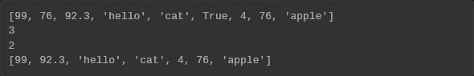
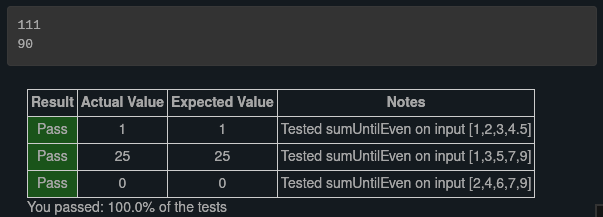
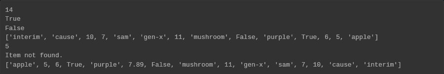
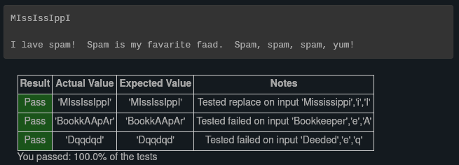
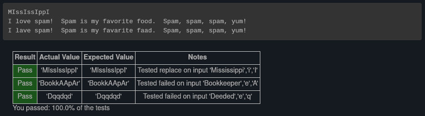
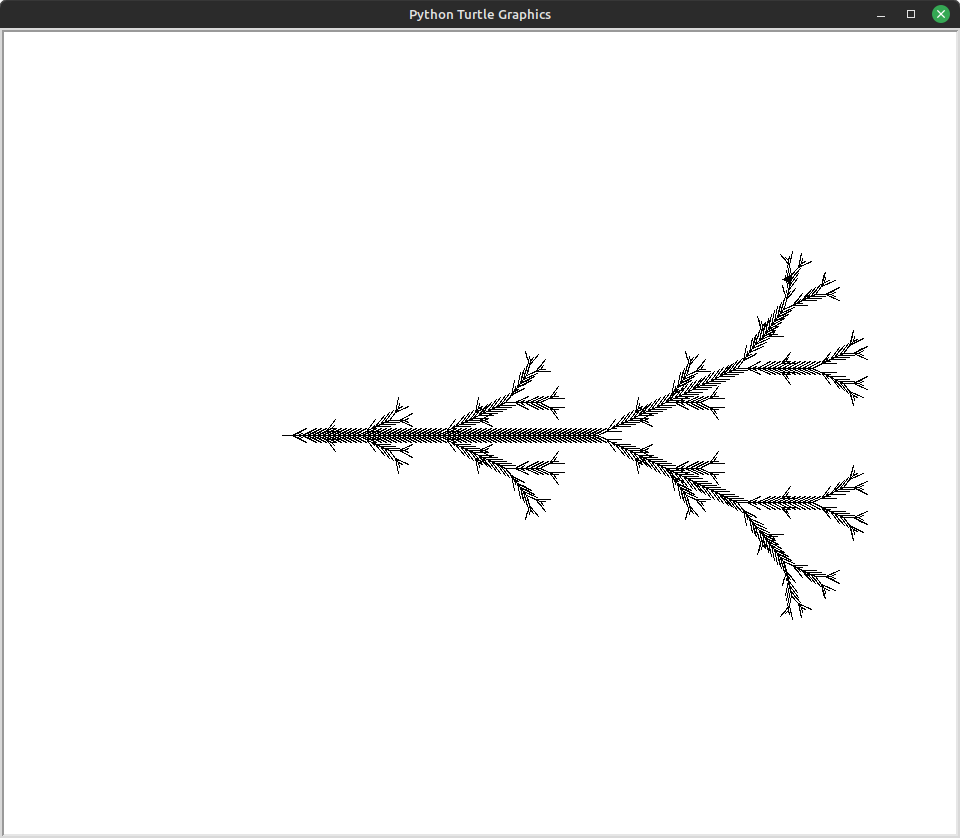
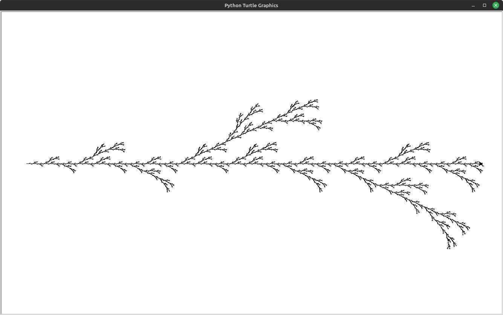

# Exercises
I'm not sure I'm starting to get a better handle on this stuff or if they were giving me a break this chapter, but this chapter was not as challenging as the previous two, but it was just as fun! There were a couple of exercises that did throw me for a loop, but it was mostly smooth sailing!

Problem 3
---------

> Starting with the list of the previous exercise, write Python statements to do the following:
> 
> 1.  Append “apple” and 76 to the list.
> 2.  Insert the value “cat” at position 3.
> 3.  Insert the value 99 at the start of the list.
> 4.  Find the index of “hello”.
> 5.  Count the number of 76s in the list.
> 6.  Remove the first occurrence of 76 from the list.
> 7.  Remove True from the list using `pop` and `index`.

I'm including this one because I think the command chaining necessary for part g is cool.

```text-x-python
# Runestone.Academy thinkcspy course
# Chapter 10
# Problem 3

myList = [76, 92.3, 'hello', True, 4, 76]

# Your code here

myList += ["apple"]
myList.insert(3, "cat")
myList.insert(0, 99)
print(myList)

print(myList.index("hello"))
print(myList.count(76))

myList.remove(76)
myList.pop(myList.index(True))

print(myList)
```

Result:



Problem 11
----------

> Sum all the elements in a list up to but not including the first even number.

Up until now, the problems had been rather straightforward, but this one presented an interesting challenge. My first attempt included a while loop:

```text-x-python
# Runestone.Academy thinkcspy course
# Chapter 10
# Problem 11

def sumUntilEven(lst):
    # your code here
    sumlist = 0
    
    for num in lst:
        while num % 2 != 0:
            sumlist += num
            
    return sumlist

mylist = [15, 85, 11, 20, 27, 38, 13]

print(sumUntilEven(mylist))
```

But then I realized that this created an infinite loop because I provided no way to exit  `while` loop. Then I tried this:

```text-x-python
# Runestone.Academy thinkcspy course
# Chapter 10
# Problem 11

def sumUntilEven(lst):
    # your code here
    sumlist = 0
    
    for num in lst:
        if num % 2 != 0:
            sumlist += num
        else:
            return sumlist

mylist = [15, 85, 11, 20, 27, 38, 13]

print(sumUntilEven(mylist))
```

My test worked, but I failed one of the built in tests, which was a list of _only_ odd numbers. And this was because I provided no return value for cases where the list contained only odd numbers. Once I added another return value, it was smooth sailing from there. Here's the final code and its results:

```text-x-python
# Runestone.Academy thinkcspy course
# Chapter 10
# Problem 11

def sumUntilEven(lst):
    # your code here
    sumlist = 0
    
    for num in lst:
        if num % 2 != 0:
            sumlist += num
        else:
            return sumlist
        
    return sumlist

mylist = [15, 85, 11, 20, 27, 38, 13]
oddlist = [13, 11, 29, 37]

print(sumUntilEven(mylist))
print(sumUntilEven(oddlist))
```

Results:



Problem 12
----------

> Count how many words occur in a list up to and including the first occurrence of the word “sam”.

I'm including this simply because I thought it was an interesting problem.

```text-x-python
# Runestone.Academy thinkcspy course
# Chapter 10
# Problem 12

def count(lst):
    # your code here
    wordCount = 0
    
    for item in lst:
        if type(item) is str:
            if item != "sam":
                wordCount += 1
            else:
                wordCount += 1
                return wordCount
            
    return wordCount

myList = ["apple", 5, 6, True, "purple", False, "mushroom", 11, "gen-x", "sam", 7, 10, "cause", "interim"]

print(count(myList))
```

Result:


Problem 13
----------

> Although Python provides us with many list methods, it is good practice and very instructive to think about how they are implemented. Implement a Python function that works like the following:
> 
> 1.  count
> 2.  in
> 3.  reverse
> 4.  index
> 5.  insert

This one was fun. The more challenging ones to think about were `index` and `in`. I take those for granted when I'm coding and as you can probably tell, I use `in` _a lot_ when I'm doing something that requires traversing through a list of items. 

```text-x-python
# Runestone.Academy thinkcspy course
# Chapter 10
# Problem 13

def count(lst):
    count = 0
    
    for num in lst:
        count += 1
        
    return count

    
def findIn(item, lst):
    pos = 0
    inLst = False
    
    while pos < len(lst) and not inLst:
        if lst[pos] == item:
            inLst = True
        else:
            pos += 1
            
    return inLst
            
     
def reverse(lst):
    newlist = []
    
    for num in lst:
        newlist = [num] + newlist
        
    return newlist
    
    
def index(item, lst):
    pos = 0
    
    for num in lst:
        if num == item:
            return pos
        else:
            pos += 1
            
    return "Item not found."


def insert(pos, item, lst):
    
    newlst = lst[:pos] + [item] + lst[pos:]
    
    return newlst


myList = ["apple", 5, 6, True, "purple", False, "mushroom", 11, "gen-x", "sam", 7, 10, "cause", "interim"]

print(count(myList))
print(findIn("purple", myList))
print(findIn(99, myList))
print(reverse(myList))
print(index(False, myList))
print(index("jello", myList))
print(insert(5, 7.89, myList))
```

Results:



Problem 14
----------

> Write a function `replace(s, old, new)` that replaces all occurences of `old` with `new` in a string `s`:
> 
> ```text-plain
> test(replace('Mississippi', 'i', 'I'), 'MIssIssIppI')
> 
> s = 'I love spom!  Spom is my favorite food.  Spom, spom, spom, yum!'
> test(replace(s, 'om', 'am'),
>        'I love spam!  Spam is my favorite food.  Spam, spam, spam, yum!')
> 
> test(replace(s, 'o', 'a'),
>        'I lave spam!  Spam is my favarite faad.  Spam, spam, spam, yum!')
> ```
> 
> _Hint_: use the `split` and `join` methods.

Okay… this one was a challenge. Here was the first iteration of my code:

```text-x-python
# Runestone.Academy thinkcspy course
# Chapter 10
# Problem 14

def replace(s, old, new):
    # your code here
        
    for item in s:
        if item == old:
            newStr = s.split(old)
            newStr = new.join(newStr)
    
    return newStr


s = 'I love spom!  Spom is my favorite food.  Spom, spom, spom, yum!'
print(replace('Mississippi', 'i', 'I'))
print(replace(s, 'om', 'am'))
print(replace(s, 'o', 'a'))
```

I got an error because I didn't initialize the variable, `newStr`. So I added `newStr = ‘’` before the `for` loop. Here was the result:



My first solution worked better than I expected, but as you can see, there was a problem with the second test, and of course, this was missed by the built in checks. 

The error that was produced as a result of not initializing `newStr` wasn't actually about `newStr`. The real problem was that my loop was only looking for one character at a time and the second test gave me _two_ characters to search and replace. So of course the program would give me an initialization error. In that instance, I was asking it to return something that could not be created given the instructions I provided. 

This reminded me of the letter problems from the previous chapter, so I referenced those to figure out how I could replace any number of characters. This is what I came up with:

```text-x-python
# Runestone.Academy thinkcspy course
# Chapter 10
# Problem 14

def replace(s, old, new):
    # your code here
    
    newStr = s
    pos1 = 0
    pos2 = len(old)
    
    while pos1 < len(s):
        item = newStr[pos1:pos2]
        
        if item == old:
            newStr = s.split(old)
            newStr = new.join(newStr)
            
        pos1 += 1
        pos2 += 2
    
    return newStr


s = 'I love spom!  Spom is my favorite food.  Spom, spom, spom, yum!'
print(replace('Mississippi', 'i', 'I'))
print(replace(s, 'om', 'am'))
print(replace(s, 'o', 'a'))
```

Results:


One step forward, two steps backward. The first test still worked, and the second one at least printed this time, but neither the second nor third test printed the expected results. 

Lawl… I really overcomplicated this. 🤦🏿‍♀️ Here is the final code:

```text-x-python
# Runestone.Academy thinkcspy course
# Chapter 10
# Problem 14

def replace(s, old, new):
    # your code here
    newStr = s.split(old)
    newStr = new.join(newStr)
    
    return newStr


s = 'I love spom!  Spom is my favorite food.  Spom, spom, spom, yum!'
print(replace('Mississippi', 'i', 'I'))
print(replace(s, 'om', 'am'))
print(replace(s, 'o', 'a'))
```

Results:



Iteration is already built into `split` and `join`, so all that extra looping I did in the previous two solutions were unnecessary. Lesson learned… hopefully.

My problem is that I hadn't fully grasp how `split` and `join` were actually working. In my head, all the words were a different item in an array, when in reality, they were a part of a single string that was then split into different array items where any occurrence of `old` was found. Then those splits were “healed” with `new`. I was thinking like a human familiar with words and sentences rather than like a computer that would see the entire string provided as a single item until told otherwise. 

More L-Systems
--------------

### Problem 15

> Here are the rules for an L-system that creates something that resembles a common garden herb. Implement the following rules and try it. Use an angle of 25.7 degrees.
> 
> ```text-plain
> H
> H --> HFX[+H][-H]
> X --> X[-FFF][+FFF]FX
> ```

Like last chapter, I really didn't have to change much. I just took existing code from the last chapter, changed the instructions in `applyRules`, changed `drawLsystem` to reflect what I learned in this chapter adjusted the angle and iterations and wallah, cool freaky pattern!

I did this one in my terminal though, because the book I'm using can only run so much. Anyway, here's the code and the result. And again, I'm leaving out the stuff that got pritned to the terminal, because it's just a long list of repeating numbers and letters. The image is more interesting. 

```text-x-python
# Runestone.Academy thinkcspy course
# Chapter 10
# Problem 15

import turtle

def createLSystem(numIters,axiom):
    startString = axiom
    endString = ""
    for i in range(numIters):
        endString = processString(startString)
        startString = endString

    return endString

def processString(oldStr):
    newstr = ""
    for ch in oldStr:
        newstr = newstr + applyRules(ch)

    return newstr

def applyRules(ch):
    newstr = ""
    if ch == 'H':
        newstr = 'HFX[+H][-H]'   # Rule 1
    elif ch == 'X':
        newstr = 'X[-FFF][+FFF]FX'   # Rule 2
    else:
        newstr = ch    # no rules apply so keep the character

    return newstr

def drawLsystem(aTurtle, instructions, angle, distance):
    savedInfoList = []
    for cmd in instructions:
        if cmd == 'F':
            aTurtle.forward(distance)
        elif cmd == 'B':
            aTurtle.backward(distance)
        elif cmd == '+':
            aTurtle.right(angle)
        elif cmd == '-':
            aTurtle.left(angle)
        elif cmd == '[':
            savedInfoList.append([aTurtle.heading(), aTurtle.xcor(), aTurtle.ycor()])
            print(savedInfoList)
        elif cmd == ']':
            newInfo = savedInfoList.pop()
            aTurtle.setheading(newInfo[0])
            aTurtle.setposition(newInfo[1], newInfo[2])

def main():
    inst = createLSystem(6, "H")   # create the string
    print(inst)
    t = turtle.Turtle()            # create the turtle
    wn = turtle.Screen()
    wn.tracer(10)

    t.up()
    t.back(200)
    t.down()
    t.speed(0)
    drawLsystem(t, inst, 25.7, 5)   # draw the picture
                                  # angle 2, segment length 5
    wn.exitonclick()

main()

```



### Problem 16

> Here is another L-System. Use an Angle of 25.
> 
> ```text-plain
> F
> F --> F[-F]F[+F]F
> ```

Same deal as problem 15 but prettier.

```text-x-python
# Runestone.Academy thinkcspy course
# Chapter 10
# Problem 16

import turtle

def createLSystem(numIters,axiom):
    startString = axiom
    endString = ""
    for i in range(numIters):
        endString = processString(startString)
        startString = endString

    return endString

def processString(oldStr):
    newstr = ""
    for ch in oldStr:
        newstr = newstr + applyRules(ch)

    return newstr

def applyRules(ch):
    newstr = ""
    if ch == 'F':
        newstr = 'F[-F]F[+F]F'   # Rule 1
    else:
        newstr = ch    # no rules apply so keep the character

    return newstr

def drawLsystem(aTurtle, instructions, angle, distance):
    savedInfoList = []
    for cmd in instructions:
        if cmd == 'F':
            aTurtle.forward(distance)
        elif cmd == 'B':
            aTurtle.backward(distance)
        elif cmd == '+':
            aTurtle.right(angle)
        elif cmd == '-':
            aTurtle.left(angle)
        elif cmd == '[':
            savedInfoList.append([aTurtle.heading(), aTurtle.xcor(), aTurtle.ycor()])
            print(savedInfoList)
        elif cmd == ']':
            newInfo = savedInfoList.pop()
            aTurtle.setheading(newInfo[0])
            aTurtle.setposition(newInfo[1], newInfo[2])

def main():
    inst = createLSystem(5, "F")   # create the string
    print(inst)
    t = turtle.Turtle()            # create the turtle
    wn = turtle.Screen()
    wn.tracer(10)

    t.up()
    t.back(600)
    t.down()
    t.speed(0)
    drawLsystem(t, inst, 25, 5)   # draw the picture
                                  # angle 25, segment length 5
    wn.exitonclick()

main()
```

Result:

