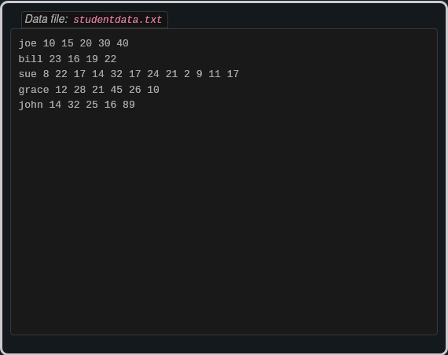
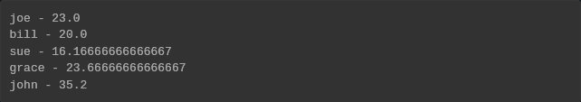
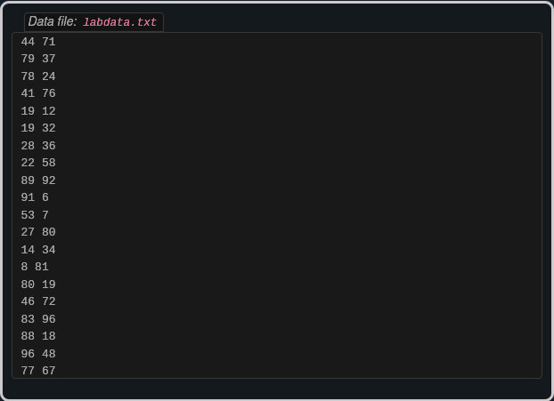
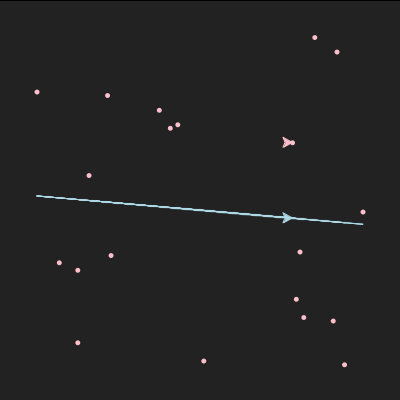
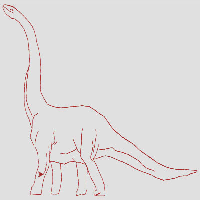

# Exercises
This lesson only had five problems, and thank goodness for that, because problem 4 really threw me for a loop. I've included all 5 here, because there are so few problems and because I genuinely found them all to be interesting problems. 

Also, I kept getting tripped up with how I interpreted the numbers from the files vs how Python interpreted them. Because they were coming from a file, those numbers were interpreted as strings, not numbers. You'd think that after my first encounter with this, I'd understand that, but I was literally still struggling with that on problem 5 lol. 

Anyway, enough talk. Let's go through the exercises. 

Student Data
------------

The following three questions uses the following file as a reference:



### Problem 1

> The following sample file called `studentdata.txt` contains one line for each student in an imaginary class. The student’s name is the first thing on each line, followed by some exam scores. The number of scores might be different for each student.
> 
> \[studentdata.txt\]
> 
> Using the text file `studentdata.txt` write a program that prints out the names of students that have more than six quiz scores.

My solution:

```text-x-python
# Runestone.Academy thinkcspy course
# Chapter 11
# Problem 1

sdfile = open("studentdata.txt", "r")

for line in sdfile:
    student = line.split()
    if len(student[1:]) > 6:
        print(student[0])
    
sdfile.close()
```

Result:


### Problem 2

> Using the text file `studentdata.txt` (shown in exercise 1) write a program that calculates the average grade for each student, and print out the student’s name along with their average grade.

My solution:

```text-x-python
# Runestone.Academy thinkcspy course
# Chapter 11
# Problem 2

sdfile = open("studentdata.txt", "r")

for line in sdfile:
    student = line.split()
    sum = 0
    avg = 0
    count = len(student[1:])
    
    for grade in student:
        if grade != student[0]:
            sum += int(grade)
            
    avg = sum/count
    
    print(student[0], "-", avg)
    
sdfile.close()
```

Result:



### Problem 3

> Using the text file `studentdata.txt` (shown in exercise 1) write a program that calculates the minimum and maximum score for each student. Print out their name as well.

My first attempt at this problem, did not get the right results, even though my logic was right. The issue was that I needed to convert the grades from strings to numbers before comparing them. Once I figured that out, everything was gucci. Here's the final code:

```text-x-python
# Runestone.Academy thinkcspy course
# Chapter 11
# Problem 3

sdfile = open("studentdata.txt", "r")

for line in sdfile:
    student = line.split()
    mingrade = student[1]
    maxgrade = student[1]
    
    for grade in student:
        if grade != student[0]:
            if int(grade) < int(mingrade):
                mingrade = grade
            if int(grade) > int(maxgrade):
                maxgrade = grade
                
    outputText = "{} - minimum score:{}; maximum score:{}".format(student[0], mingrade, maxgrade)
                
    print(outputText)
    
sdfile.close()
```

Result:


Problem 4
---------

> Here is a file called `labdata.txt` that contains some sample data from a lab experiment.
> 
> 
> 
> Interpret the data file `labdata.txt` such that each line contains a an x,y coordinate pair. Write a function called `plotRegression` that reads the data from this file and uses a turtle to plot those points and a best fit line according to the following formulas:
> 
> \\(y = \\bar{y} + m(x - \\bar{x})\\)
> 
> \\(m = \\frac{\\sum{x\_iy\_i - n\\bar{x}\\bar{y}}}{\\sum{x\_i^2}-n\\bar{x}^2}\\)
> 
> where \\(\\bar{x}\\) is the mean of the x-values, \\(\\bar{y}\\) is the mean of the y- values and is the number of points. If you are not familiar with the mathematical \\(\\sum\\) it is the sum operation. For example \\(\\sum{x\_i}\\) means to add up all the x values.
> 
> Your program should analyze the points and correctly scale the window using `setworldcoordinates` so that that each point can be plotted. Then you should draw the best fit line, in a different color, through the points.

Mkay… this one was kind of a pain in the ass, from formatting the instructions above, to refreshing myself on how sums worked, to actually structuring the solution. But I got through it. 

First attempt:

```text-x-python
# Runestone.Academy thinkcspy course
# Chapter 11
# Problem 4

import turtle

with open('labdata.txt') as lab:
    
    def plotRegression():
        sumx = 0
        sumy = 0
        sumxy = 0
        sumxsq = 0
        count = 0
        meanx = 0
        meany = 0
        
        '''this is basically a normal linear line except with average values'''
        
        for line in lab:
            x = int(line[0])
            y = int(line[1])
            sumx += x
            sumy += y
            sumxy += x*y
            sumxsq += x**2
            count += 1
            
        meanx = sumx/count
        meany = sumy/count
        #meanxsq = meanx**2
        
        slope = (sumxy - (count*meanx*meany))/(sumxsq - (count*meanx**2)) #m
        
        for line in lab:
            plot = meany + slope(line[0] - meanx) #y
            plotTurtle(line[0], line[1], plot)
            
    def plotTurtle(x, y, plot):
        wn = turtle.Screen()
        ella = turtle.Turtle() #points from the labdata.txt
        #maya = turtle.Turtle() #line of best fit (y)
        
        ella.up()
        ella.goto(x,y)
        ella.down()
        ella.stamp()
        ella.up()
        
        wn.exitonclick()
        
        
plotRegression()
```

I forgot to split each line, so of course I was getting an error. 

Next, needed to figure out accurately getting the values needed for the equations.

I ended up separating the calculation of slope from the calculation of the regression line into two separate functions decided to send the list of x and y values, the mean x and y, and the slope through as parameters to the `plotRegression` function. 

```text-x-python
# Runestone.Academy thinkcspy course
# Chapter 11
# Problem 4

import turtle
    
def slope():
    xlist = []
    ylist = []
    sumx = 0
    sumy = 0
    sumxy = 0
    sumxsq = 0
    count = 0     #n
    meanx = 0
    meany = 0
    slope = 0     #m
        
    with open('labdata.txt') as lab:
        for line in lab:
            values = line.split()
            xlist += [int(values[0])]
            ylist += [int(values[1])]
            x = int(values[0])
            y = int(values[1])
            sumx += x
            sumy += y
            sumxy += x*y
            sumxsq += x**2
            count += 1

    meanx = sumx / count
    meany = sumy / count
    
    slope = (sumxy - count*meanx*meany) / (sumxsq - count*meanx**2)
        
    plotRegression(xlist, ylist, meanx, meany, slope)
    
    
    
def plotRegression(xlist, ylist, meanx, meany, slope):
    for x in xlist:
        yplot = meany + slope*(x - meanx)
        
        plotTurtle(x, yplot)        
    

    
def plotTurtle(x, y):
    wn = turtle.Screen()
    ella = turtle.Turtle() #points from the labdata.txt
    #maya = turtle.Turtle() #line of best fit (y)

    ella.up()
    ella.goto(x,y)
    ella.down()
    ella.stamp()
    ella.up()

    wn.exitonclick()
    
slope()
```

This helped clean up the code a bit, but I still had the issue of exactly how I was going to plot the line and the x and y value pairs at the same time. I knew that I couldn't just do a simple nested loop. That would result in one of those values being referenced too many times. I needed to find a way to go through both `xlist` and `ylist` at the same time.

So I didn't need a _simple_ nested loop, but I _did_ need a nested loop. What I figured out was that I needed two new variables: one to use as a binary and another to use an index for one of the lists. 

The binary variable was there to keep the value from the first list from being repeated and the index was there to make sure the right value from the second list was being sent to `plotTurtle`. This is what `plotRegression` ended up looking like once I figured that out:

```text-x-python
def plotRegression(xlist, ylist, meanx, meany, slope):
    i = 0
    
    for x in xlist:
        j = 0
        yplot = meany + slope*(x - meanx)
        
        while not j:
            plotTurtle(x, ylist[i], yplot)
            j += 1
        
        i += 1
```

Now I needed to figure out getting my turtles to draw a line from `yplot` rather than just a series of points. 

Because of the way I was feeding points to `plotTurtle`, the turtles would go back to their starting point, before going back to their respective, (x,y) positions. This is fine for the turtle plotting the original x and y value pairs, but not fine for the turtle plotting the line of best fit. I needed to make sure that the second turtle stayed where it was when it got fed the next plot point.

Turns out the solution to making it stay where it was, was just to have the turtles in the the same function where `yplot` was being calculated. Now all that was left was to get the world coordinates to scale (and change up the colors, just because).

Here's te final code:

```text-x-python
# Runestone.Academy thinkcspy course
# Chapter 11
# Problem 4

import turtle
    
def slope():
    xlist = []
    ylist = []
    sumx = 0
    sumy = 0
    sumxy = 0
    sumxsq = 0
    count = 0     #n
    meanx = 0
    meany = 0
    slope = 0     #m
        
    with open('labdata.txt') as lab:
        for line in lab:
            values = line.split()
            xlist += [int(values[0])]
            ylist += [int(values[1])]
            x = int(values[0])
            y = int(values[1])
            sumx += x
            sumy += y
            sumxy += x*y
            sumxsq += x**2
            count += 1

    meanx = sumx / count
    meany = sumy / count
    
    slope = (sumxy - count*meanx*meany) / (sumxsq - count*meanx**2)
        
    plotRegression(xlist, ylist, meanx, meany, slope)
    
    
    
def plotRegression(xlist, ylist, meanx, meany, slope):
    #set world coordinates
    minx = xlist[0]
    miny = ylist[0]
    maxx = xlist[0]
    maxy = ylist[0]
    count = len(xlist)
    num = 0
    
    while num < count:
        if xlist[num] < minx:
            minx = xlist[num]
        if xlist[num] > maxx:
            maxx = xlist[num]
        if ylist[num] < miny:
            miny = ylist[num]
        if ylist[num] > maxy:
            maxy = ylist[num]
            
        num += 1
        
    turtle.setworldcoordinates(minx-10, miny-10, maxx+10, maxy+10)
    
    #plot points
    i = 0 
    wn = turtle.Screen()
    wn.bgcolor("#222")
    ella = turtle.Turtle() #points from the labdata.txt
    ella.color("pink")
    maya = turtle.Turtle() #line of best fit (yplot)
    maya.color("lightblue")
            
    for x in xlist:
        j = 0
        yplot = meany + slope*(x - meanx)
        
        while not j:
            ella.up()
            ella.goto(x, ylist[i])
            ella.dot()
            
            if i != 0:
                maya.goto(x, yplot)
            else:
                maya.up()
                maya.goto(x, yplot)
                maya.down()
                
            j += 1
        
        i += 1   

    wn.exitonclick()
    
slope()
```

Result:



Problem 5
---------

> At the bottom of this page is a very long file called `mystery.txt` The lines of this file contain either the word UP or DOWN or a pair of numbers. UP and DOWN are instructions for a turtle to lift up or put down its tail. The pairs of numbers are some x,y coordinates. Write a program that reads the file `mystery.txt` and uses the turtle to draw the picture described by the commands and the set of points.

It's long, so I'll just link to the data in `mystery.txt` [here](Exercises/mystery.txt.md). 

Drawing the image was relatively straightforward. It was getting the world coordinates that was challenging, even though I literally just did the same thing in the previous problem. 

The challenge was that this time, just splitting the data into x and y coordinates was not that simple. I now had to contend with strings `“UP”` and `“DOWN”`, as well. 

What also threw me for a loop was that the program was expecting me to initialize the min/max variables before what I thought of as the actual initialization (assigning the variables to the first numbers in the file). My guess is that I had to go through this extra step, because unlike in the previous problem, I was pulling the numbers directly from the file instead of an array. 

Anywho, here's my solution:

```text-x-python
# Runestone.Academy thinkcspy course
# Chapter 11
# Problem 5

import turtle

def getMinMax():
    #get world coordinates
    minx = 0
    miny = 0
    maxx = 0
    maxy = 0

    with open('mystery.txt') as data:
        for line in data:
            values = line.split()
            if values[0] != "UP" and values[0] != "DOWN": 
                minx = int(values[0])
                miny = int(values[1])
                maxx = int(values[0])
                maxy = int(values[1]) 
            break
                
        for line in data:
            values = line.split()
            if values[0] != "UP" and values[0] != "DOWN":
                if int(values[0]) < minx:
                    minx = int(values[0])
                if int(values[0]) > maxx:
                    maxx = int(values[0])
                if int(values[1]) < miny:
                    miny = int(values[1])
                if int(values[1]) > maxy:
                    maxy = int(values[1])

    draw(minx, miny, maxx, maxy)
        
        
        
def draw(minx, miny, maxx, maxy):    
    turtle.setworldcoordinates(minx-10, miny-10, maxx+10, maxy+10)
    
    wn = turtle.Screen()
    wn.bgcolor("#e0e0e0")
    ella = turtle.Turtle()
    ella.color("brown")
    
    with open('mystery.txt') as data:
        for line in data:
            values = line.split()
            
            if values[0] == "UP":
                ella.up()
            elif values[0] == "DOWN":
                ella.down()
            else:
                x = int(values[0])
                y = int(values[1])
                ella.goto(x,y)

getMinMax()
    
```

Result:



It's a dinosaur!

And here's a gif of Python actually generating the image from the instructions. Figured that'd be more interesting than a static image:

