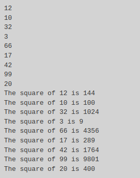
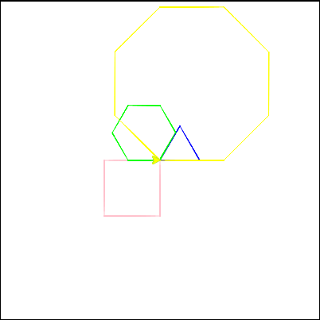
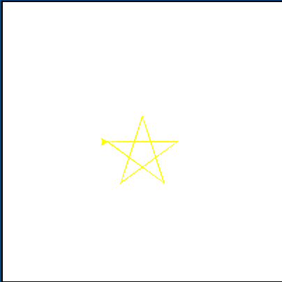
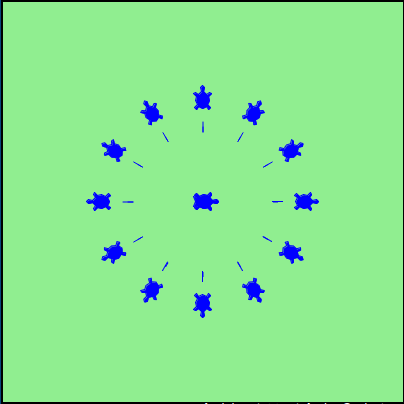
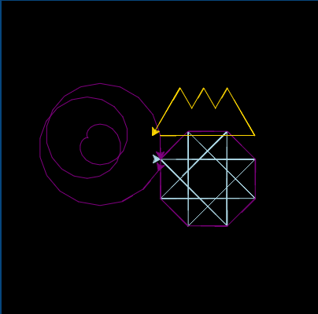

# Exercises
This lesson had a bunch of exercises in it, but I just picked a few that best showcased what I learned which was mostly about using `for` loops and the `Turtle()` object. 

Problem 4
---------

_Assume you have a list of numbers_ `12, 10, 32, 3, 66, 17, 42, 99, 20`

1.  _Write a loop that prints each of the numbers on a new line._
2.  _Write a loop that prints each number and its square on a new line._

### My code

This one had a visual counterpart, but that would require me including a video which is something I'm simply not keen on doing, right now. So here are some text and numbers instead.

```text-x-python
# Runestone.Academy thinkcspy course
# Chapter 4
# Problem 4

for i in [12, 10, 32, 3, 66, 17, 42, 99, 20]:
    print(i)

for i in [12, 10, 32, 3, 66, 17, 42, 99, 20]:
    print("The square of", i,"is", i**2)
```

### Result



Problem 5
---------

_Use_ `for` _loops to make a turtle draw these regular polygons (regular means all sides the same lengths, all angles the same):_

*   _An equilateral triangle_
*   _A square_
*   _A hexagon (six sides)_
*   _An octagon (eight sides)_

### My code:

```text-x-python
# Runestone.Academy thinkcspy course
# Chapter 4
# Problem 5

import turtle
wn = turtle.Screen()
avery = turtle.Turtle()
avery.color("blue")
dun = turtle.Turtle()
dun.color("pink")
elliot = turtle.Turtle()
elliot.color("lime")
missy = turtle.Turtle()
missy.color("yellow")

for i in range(3):
    avery.forward(50)
    avery.left(120) 
    
for i in range(4):
    dun.backward(70)
    dun.left(90)
    
for i in range(6):
    elliot.left(60)
    elliot.forward(40)
    
for i in range(8):
    missy.right(45)
    missy.backward(80)
    
wn.exitonclick()
```

### Result:



Problem 9
---------

_Write a program to draw a shape like this:_

__

### My Code:

I probably need to go back to and relearn geometry lol. Took me forever to figure out the right angle. 

In case you're curious (and not a geometry wiz), to draw any type of star you need the formula \\(a = 180 - 360/(n/2)\\) or more simply \\(a=180-180/n\\), where \\(a\\) is the angle and \\(n\\) is the number of sides. Now, I'll do my best to explain why this works.

To find the angle of a normal polygon, you need to divide 360 by the number of sides, which would be expressed as \\(a=360/n\\). But a star is like an inverted form of a polygon that has bunch of unfinished interconnecting triangles. Unlike polygons with 4+ sides, all the angles of a triangle must equal 180 — and coincidentally, that happens to be the case with stars as well. Don't ask me why, I don't know. It's been well over a decade since I've had to touch do any geometry like this lol. 

If you look closely at the center of the star presented above, you'll notice a pentagon in the center. Extending from every angle of that pentagon are triangles. Again, we know that the angles of triangles must total of 180 and we also know that each angle in the star is the same, so we can treat these triangles as equilateral triangles. This means that each angle of the arms will be half the angle its polygon counterpart, hence the \\(360/(n/2)\\), where the \\(2\\) is simply halving each angle of the original polygon.

Now, if we were just trying to find the acute angle present in the star, we could stop here, but at least for the way I drew my star, I actually need an obtuse angle, because the program is tracing around and through the star. This is where the \\(180\\) comes in. I need to subtract the acute angle from \\(180\\) to get to the angle I need to create the star. You can actually see this angle in the concave portions of the star. 

So all that is how I got to \\(a = 180 - 360/(n/2)\\). I probably could have looked this up — and I did partially, which is how I understood to treat the star like a triangle — but otherwise I just played around with it until I figured it out. 

```text-x-python
# Runestone.Academy thinkcspy course
# Chapter 4
# Problem 9

import turtle
wn = turtle.Screen()

stella = turtle.Turtle()
stella.color("yellow")

stella.up()
stella.forward(-50)
stella.down()

for i in range(5):
    stella.left(144)
    stella.forward(-100)

wn.exitonclick()
```

### Result



Problem 10
----------

_Write a program to draw a face of a clock that looks something like this:_

__

### My Code:

```text-x-python
# Runestone.Academy thinkcspy course
# Chapter 4
# Problem 10

import turtle
wn = turtle.Screen()

wn.bgcolor("lightgreen")

stella = turtle.Turtle()
stella.color("blue")
stella.shape("turtle")

avery = turtle.Turtle()
avery.color("blue")

stella.up()
avery.up()

stella.stamp()

for i in range(12):
    stella.forward(100)
    stella.stamp()
    
    avery.forward(70)
    avery.down()
    avery.forward(10)
    avery.up()
    
    stella.forward(-100)    
    avery.forward(-80)    
    
    stella.right(30)
    avery.right(30)
    
wn.exitonclick()
```

### Result



Problem 11
----------

_Write a program to draw some kind of picture. Be creative and experiment with the turtle methods provided in Summary of Turtle Methods._

### My Code

Used what I learned from problem 9 on this one. Even took the time to figure out getting the star to fit inside its corresponding polygon. Then I made a weird spiral thingy and was like “ooh that looks like a huge ponytail!”and then I made a crown. That one took me forever to figure out too, but I don't really have a rationale for you for this one. 

```text-x-python
# Runestone.Academy thinkcspy course
# Chapter 4
# Problem 10

 import turtle
wn = turtle.Screen()

wn.bgcolor("black")

stella = turtle.Turtle()
stella.color("lightblue")
stella.speed(10)

avery = turtle.Turtle()
avery.color("purple")
avery.speed(10)
avery.up()
avery.right(90)
avery.down()

missy = turtle.Turtle()
missy.color("purple")
missy.speed(10)
missy.up()
missy.left(90)
missy.down()

dun = turtle.Turtle()
dun.color("gold")
dun.speed(10)
dun.up()
dun.left(90)
dun.forward(30)
dun.right(90)
dun.down()

for i in range(8):
    stella.left(135)
    stella.forward(-120)
    
    avery.right(45)
    avery.forward(-50)

for i in range(30, -32, -1):
    missy.forward(i)
    missy.left(20)

dun.forward(120)
dun.left(120)
dun.forward(70)
for i in range(2):
    dun.left(120)
    dun.forward(30)
    dun.right(120)
    dun.forward(30)
dun.left(120)
dun.forward(70)
    
wn.exitonclick()
```

### Result

