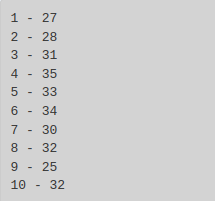
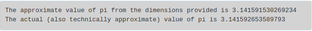

# Exercises
So this lesson only had 4 exercises (from what I could see, anyway), but for some reason they start at 16. 

At any rate, this lesson was about modules. `math` and `random` were at the focus of the lesson and its exercises. 

Problem 16
----------

_Use a_ `for` _statement to print 10 random numbers._

### My Code

```text-x-python
# Runestone.Academy thinkcspy course
# Chapter 5
# Problem 16

import random

for i in range(10):
    prob = random.random()
    print(i+1, '-', prob)
```

### Result


Result from the first run of this script

Problem 17
----------

_Repeat the above exercise but this time print 10 random numbers between 25 and 35, inclusive._

### My Code

```text-x-python
# Runestone.Academy thinkcspy course
# Chapter 5
# Problem 17

import random

for i in range(10):
    prob = random.randrange(25, 36)
    print(i+1, '-', prob)
```

### Result



Result from the first run of this script

Problem 18
----------

_The **Pythagorean Theorem** tells us that the length of the hypotenuse of a right triangle is related to the lengths of the other two sides. Look through the_ `math` _module and see if you can find a function that will compute this relationship for you. Once you find it, write a short program to try it out._

### My Code

```text-x-python
# Runestone.Academy thinkcspy course
# Chapter 5
# Problem 18

import math

a = float(input('What is the length of the first side of the triangle?'))
b = float(input('What is the length of the second side of the triangle?'))
 
c = math.sqrt(a*a + b*b)

print('The hypotenuse of this triangle with is', c, '.')
```

### Result


The numbers used to get this result were 12 and 12.

Problem 19
----------

_Search on the internet for a way to calculate an approximation for **pi**. There are many that use simple arithmetic. Write a program to compute the approximation and then print that value as well as the value of_ `math.pi` _from the math module._

### My Code

```text-x-python
# Runestone.Academy thinkcspy course
# Chapter 5
# Problem 19

import math

c = float(input("Today we are going to calculate pi from the dimensions of a circle. What is the circumference of your circle?"))
d = float(input("And what is the diameter of your circle?"))
               
zpi = c/d

print("The approximate value of pi from the dimensions provided is", zpi)
print("The actual (also technically approximate) value of pi is", math.pi)
```

### Result



The numbers were 22.2817 for the diameter and 70 for the circumference. The numbers were generated on [this site](https://www.omnicalculator.com/math/circle-measurements).