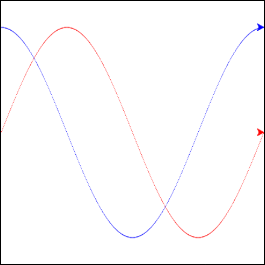

# Lab: Plotting a Sine Wave

Create and set up the turtle and the screen.

Iterate the angle from 0 to 360.

> Generate the sine value for each angle.
> 
> Move the turtle to that position (leave a line behind).

_My note: the lab encouraged us to try other functions out, so I included a turtle drawing cosign._

```text-x-python
import math
import turtle

wn = turtle.Screen()
wn.bgcolor('lightblue')

turtle.setworldcoordinates(0, -1.25, 360, 1.25)

fred = turtle.Turtle()
fred.speed(10)
fred.color('red')

george = turtle.Turtle()
george.speed(10)
george.color('blue')

for angle in range(361):
    x = angle
    y = math.sin(math.radians(angle))
    fred.goto(x,y)
    
for angle in range(361):
    x = angle
    y = math.cos(math.radians(angle))
    george.goto(x,y)

wn.exitonclick()
```

