# Exercises
Problem 1
---------

> Use the drawsquare function we wrote in this chapter in a program to draw the image shown below. Assume each side is 20 units. (Hint: notice that the turtle has already moved away from the ending point of the last square when the program ends.)
> 
> 

Most of this code was already added. The only things I added were the pensize and the `drawManySquares` function and call.

```text-x-python
# Runestone.Academy thinkcspy course
# Chapter 6
# Problem 1

import turtle

def drawSquare(t, sz):
    """Get turtle t to draw a square of sz side"""

    for i in range(4):
        t.forward(sz)
        t.left(90)

wn = turtle.Screen()
wn.bgcolor("lightgreen")

alex = turtle.Turtle()
alex.color("pink")
alex.pensize(2)


def drawManySquares(tt, num):
    for i in range(num):
        drawSquare(tt, 20)
        tt.up()
        tt.forward(30)
        tt.down()
        

drawManySquares(alex, 5)        
        

wn.exitonclick()
```

Result

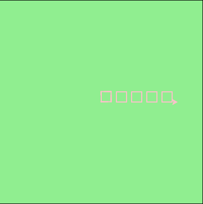

Problem 2
---------

> Write a program to draw this. Assume the innermost square is 20 units per side, and each successive square is 20 units bigger, per side, than the one inside it.
> 
> 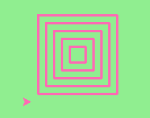

```text-x-python
# Runestone.Academy thinkcspy course
# Chapter 6
# Problem 2

import turtle

def drawSquare(t, sz):
    """Get turtle t to draw a square of sz side"""

    for i in range(4):
        t.forward(sz)
        t.left(90)

wn = turtle.Screen()
wn.bgcolor("lightgreen")

alex = turtle.Turtle()
alex.color("pink")
alex.pensize(2)


def drawStackedSquares(tt, num):
    for i in range(num):
        drawSquare(tt, 20*(i+1))
        tt.up()
        tt.backward(10)
        tt.left(90)
        tt.backward(10)
        tt.right(90)
        tt.down()
        

drawStackedSquares(alex, 5)        
        

wn.exitonclick()
```

Result:

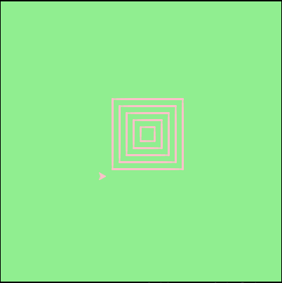

Problem 3
---------

> Write a non-fruitful function `drawPoly(someturtle, somesides, somesize)` which makes a turtle draw a regular polygon. When called with `drawPoly(tess, 8, 50)`, it will draw a shape like this:
> 
> 

Lol… I realized I didn't fully read the instructions and didn't name the parameters or the function the way they wanted me to, but… the result is the same so, I think I did my job. 

```text-x-python
# Runestone.Academy thinkcspy course
# Chapter 6
# Problem 3

import turtle

def drawPolygon(t, sideLength, numSides):
    """Make turtle t draw a polygon."""
    angle = 360/numSides
    
    for i in range(numSides):
        t.forward(sideLength)
        t.left(angle)


wn = turtle.Screen()
wn.bgcolor("lightgreen")

tess = turtle.Turtle()
tess.color("pink")
tess.pensize(2)

drawPolygon(tess,50,8) 

wn.exitonclick()
```

Result:

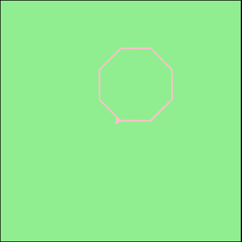

Problem 4
---------

> Draw this pretty pattern.
> 
> 

```text-x-python
# Runestone.Academy thinkcspy course
# Chapter 6
# Problem 4

import turtle

def drawSquare(t, sz):
    """Get turtle t to draw a square of sz side"""

    for i in range(4):
        t.forward(sz)
        t.left(90)

wn = turtle.Screen()
wn.bgcolor("lightgreen")

alex = turtle.Turtle()
alex.color("blue")
alex.pensize(2)
alex.speed(10)


def drawCircleSquares(tt, num):
    for i in range(num):
        drawSquare(tt, 80)
        tt.right(15)
        

drawCircleSquares(alex, 25)        
        

wn.exitonclick()
```

Result:

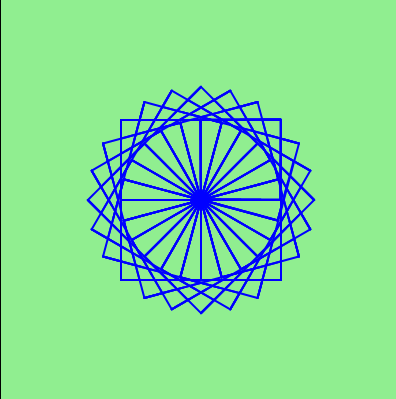

Problem 5
---------

> The two spirals in this picture differ only by the turn angle. Draw both.
> 
> 

It took me a minute to realize that was the angle for the spiral on the right was literally just 1° different. Also.. I made Tess purple. Gotta have some variety. 

```text-x-python
# Runestone.Academy thinkcspy course
# Chapter 6
# Problem 5

import turtle

def drawSquareSpiral(t, sz, num, angle):
    """Get turtle t to draw a square of sz side"""
    
    for i in range(num):
        t.forward(sz*i)
        t.left(angle)

wn = turtle.Screen()
wn.setworldcoordinates(-300,-300,300,300)
wn.bgcolor("lightgreen")


alex = turtle.Turtle()
alex.color("blue")
alex.speed(0)
alex.up()
alex.goto(-150,0)
alex.down()

tess = turtle.Turtle()
tess.color("purple")
tess.speed(0)
tess.up()
tess.goto(150,0)
tess.down()

drawSquareSpiral(alex,2,100,90)

drawSquareSpiral(tess,2,100,91)
        

wn.exitonclick()
```

Result:

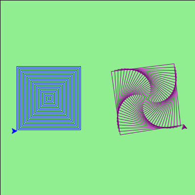

Problem 10
----------

> Extend your program above. Draw five stars, but between each, pick up the pen, move forward by 350 units, turn right by 144, put the pen down, and draw the next star. You’ll get something like this (note that you will need to move to the left before drawing your first star in order to fit everything in the window):
> 
> 

I really don't like the pink and green, so I went with purple and tan instead. The program to be extended was the `drawStar` function. 

```text-x-python
# Runestone.Academy thinkcspy course
# Chapter 6
# Problem 10

import turtle

def drawStar(t):
    for i in range(5):
        t.left(144)
        t.forward(-100)

def drawFiveStars(tt):
    tt.up()
    tt.goto(-180,50)
    tt.down()
    
    for i in range(5):
        drawStar(tt)
        tt.up()
        tt.forward(350)
        tt.right(144)
        tt.down()
    
wn = turtle.Screen()
wn.bgcolor("tan")

stella = turtle.Turtle()
stella.color("purple")
stella.pensize(2)
stella.speed(10)
    
drawFiveStars(stella)

wn.exitonclick()
```

Result:

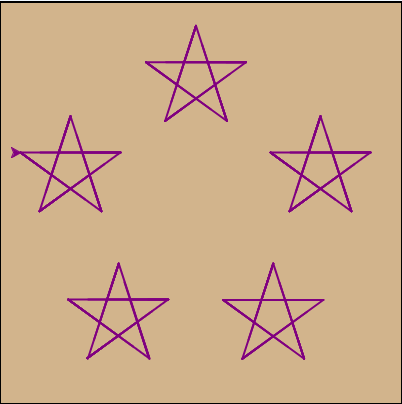

Problem 11
----------

> Extend the star function to draw an n pointed star. (Hint: n must be an odd number greater or equal to 3).

This one was a lot of fun! I decided to do the most and get some user input and give feedback. 

```text-x-python
# Runestone.Academy thinkcspy course
# Chapter 6
# Problem 11

import turtle

def drawStar(t, numSides, sideLength):
    angle = 180 - 180/numSides
    
    t.up()
    t.goto(sideLength/2,0)
    t.down()
    
    for i in range(numSides):
        t.left(angle)
        t.forward(sideLength)

def checkSides(tt, sides, length):
    if sides >= 3 and sides % 2 != 0:
        print("What a beautiful star!")
        drawStar(tt, sides, length)
    else:
        print("Oops! Your star must have an ODD number of at least 3 sides. Let's try that again!")

    
wn = turtle.Screen()
wn.bgcolor("tan")

stella = turtle.Turtle()
stella.color("purple")
stella.pensize(2)
stella.speed(0)

a = int(input("Help Stella draw a star! How many points does the star have?"))
b = int(input("How long is each side?"))        

checkSides(stella, a, b)

wn.exitonclick()
```

Results:

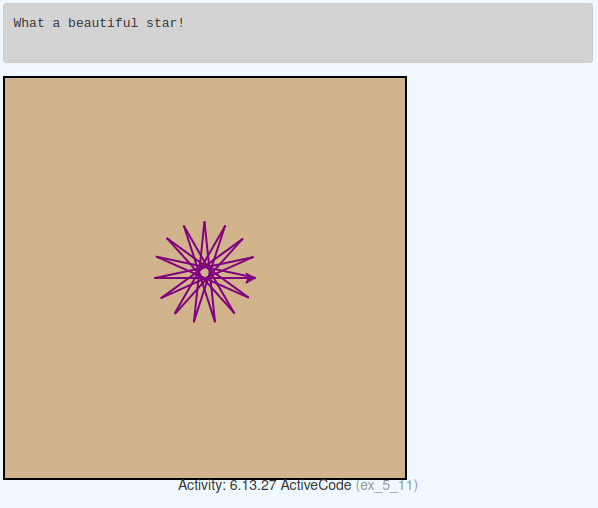

Input for `a`: `15`. Input for `b`: `100`

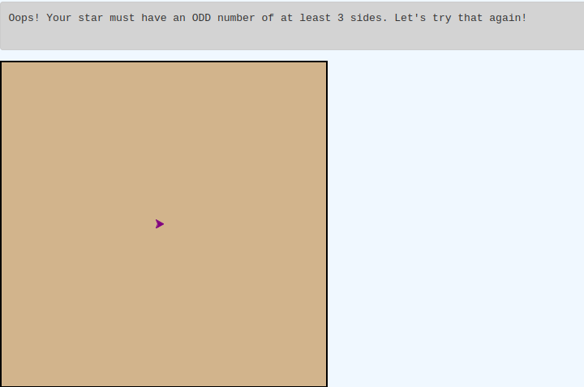

Input for `a`: `30`, input for `b`: `100`

Problem 12
----------

> Write a function called drawSprite that will draw a sprite. The function will need parameters for the turtle, the number of legs, and the length of the legs. Invoke the function to create a sprite with 15 legs of length 120.

```text-x-python
# Runestone.Academy thinkcspy course
# Chapter 6
# Problem 12

import turtle

def drawSprite(t, numSides, legLength):
    angle = 360/numSides
    
    for i in range(numSides):
        t.forward(legLength)
        t.up()
        t.forward(-legLength)    
        t.right(angle)
        t.down()


wn = turtle.Screen()

wn.bgcolor("tan")

avery = turtle.Turtle()
avery.color("brown")

drawSprite(avery, 15, 120)

    
wn.exitonclick()
```

Result:

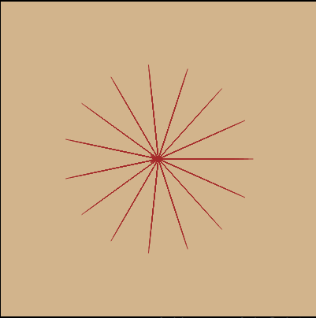

Problem 13
----------

> Rewrite the function `sumTo(n)` that returns the sum of all integer numbers up to and including n. This time use the accumulator pattern.

The original solution from problem 7 (the equation was given in the instructions: adding numbers 1-10):

```text-x-python
# Runestone.Academy thinkcspy course
# Chapter 6
# Problem 7

def sumTo(n):
    # your code here
    y = (n*(n+1))/2
    return y

print(sumTo(10))
```

The modified code for this problem:

```text-x-python
# Runestone.Academy thinkcspy course
# Chapter 6
# Problem 13

def sumTo(n):
    # your code here
    runningTotal = 0
    
    for counter in range(n):
        runningTotal = runningTotal + (n+1)/2
        
    return runningTotal

print(sumTo(10))
```

I've got to be honest, both solutions seem more complicated than they should be. I'll have to take a closer look to see why the solutions are what they are. 

Problem 14
----------

> Write a function called `mySqrt` that will approximate the square root of a number, call it n, by using Newton’s algorithm. Newton’s approach is an iterative guessing algorithm where the initial guess is n/2 and each subsequent guess is computed using the formula: newguess = (1/2) \* (oldguess + (n/oldguess)).

I'm adding this one here, because it took me a minute to figure out the most efficient way to compute. this. At first I had a for loop, but that was taking way too many steps for the program to get to the right answer. Then I did a for loop with a break and that was better, but that was still taking the program too many steps. 

Finally, I realized that I could just create this program with a while loop and that drastically reduced the amount of steps the program had to go through. It still seems to be going through a few too any checks, but I think it's okay for my current skill level. Plus, it passed all the built in checks!

```text-x-python
# Runestone.Academy thinkcspy course
# Chapter 6
# Problem 14

def mySqrt(n):
    # your code here
    oldGuess = n/2
    
    while oldGuess**2 != n:
        oldGuess = (1/2)*(oldGuess+(n/oldGuess))
    
    return oldGuess
    
print(mySqrt(10000))
```

Result:

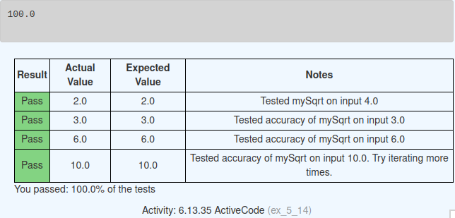

Problem 15
----------

> Write a function called `myPi` that will return an approximation of PI (3.14159…). Use the [Leibniz](http://en.wikipedia.org/wiki/Leibniz_formula_for_%CF%80) approximation.

This is here because, what the hell? They got me approximating pi now?? _cries in calc 1_

```text-x-python
# Runestone.Academy thinkcspy course
# Chapter 6
# Problem 15

def myPi(iters):    
    # Calculate an approximation of PI using the Leibniz
    # approximation with iters number of iterations
    
    # your code here  
    apprPi = 0
    
    for i in range(iters):
        term = (-1)**i/(2*i+1)
        apprPi += term
    
    return apprPi * 4
        
print(myPi(1000000))
```

Result:

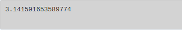

Problem 16
----------

> Write a function called myPi that will return an approximation of PI (3.14159…). Use the [Madhava](http://en.wikipedia.org/wiki/Madhava_of_Sangamagrama) approximation.

Lol this is the above problem but the calculations to get there are on steroids. They weren't kidding when they said this equation converges to real value of pi faster. The last one took 1000000 iterations to get to 3.14519. This one only took 9... (10 if you want to round it). That's insane.

```text-x-python
# Runestone.Academy thinkcspy course
# Chapter 6
# Problem 16

import math

def myPi(iters):
    # Calculate an approximation of PI using the Madhava
    # approximation with iters number of iterations

    #your code here
    apprPi = 0
    
    for i in range(iters):
        term = (-1)**i/((2*i+1)*3**i)
        apprPi += term
    
    return apprPi * math.sqrt(12)
        
print(myPi(10))
```

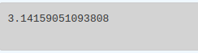

Problem 17
----------

> Write a function called fancySquare that will draw a square with fancy corners (sprites on the corners). You should implement and use the drawSprite function from above. For an even more interesting look, how about adding small triangles to the ends of the sprite legs.

```text-x-python
# Runestone.Academy thinkcspy course
# Chapter 6
# Problem 17

import turtle

def drawSprite(t, numSides, legLength):
    angle = 360/numSides
    
    for i in range(numSides):
        t.forward(legLength)
        t.up()
        t.forward(-legLength)    
        t.right(angle)
        t.down()

def fancySquare(tt, sz):
    """Get turtle t to draw a square of sz side"""

    for i in range(4):
        drawSprite(tt, int(sz/10), int(sz/20))
        tt.forward(sz)
        tt.left(90)

wn = turtle.Screen()
wn.bgcolor("lightblue")

alex = turtle.Turtle()
alex.color("maroon")
alex.pensize(2)

fancySquare(alex, 100)
```

Result:

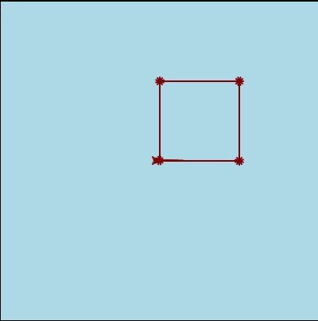

Problem 18
----------

> There was a whole program in A Turtle Bar Chart to create a bar chart with specific data. Creating a bar chart is a useful idea in general. Write a non-fruitful function called barChart, that takes the numeric list of data as a parameter, and draws the bar chart. Write a full program calling this function. The current version of the `drawBar` function unfortuately draws the top of the bar through the bottom of the label. A nice elaboration is to make the label appear completely above the top line. To keep the spacing consistent you might pass an extra parameter to `drawBar` for the distance to move up. For the `barChart` function make that parameter be some small fraction of `maxheight+border`. The fill action makes this modification particularly tricky: You will want to move past the top of the bar and write before or after drawing and filling the bar.

Phew we made it to the last problem! 

Lol they must have known we wouldn't do right in the lesson. We had to work on this exact code and bring the numbers further above the bars. They gave us this (with the code of course):

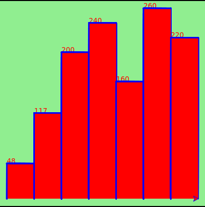

And I did this:

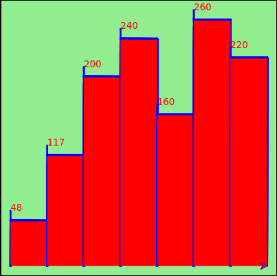

Technically, I did _solve_ the problem but was tired and didn't feel like dealing with the little line that appeared as a result of combing `write` and `fill` within the same function. But then we got this problem in the exercises lol and they specifically mentioned the “trickiness” of being able to write the data and fill the bars at the same time. Presumably because of that little extra line. 

So this time I actually did deal with the little line. Created a second turtle, `alex`, and a separate function `writeData`, for `alex` to write with. Also changed the colors, because what even is that red blue green color combo? 

Anyway, here is the code:

```text-x-python
# Runestone.Academy thinkcspy course
# Chapter 6
# Problem 18	

import turtle

def writeData(tt, height):
    tt.up()
    tt.left(90)
    tt.forward(height+10)
    tt.right(90)
    tt.forward(10)
    tt.write(str(height))
    tt.forward(30)
    tt.right(90)
    tt.forward(height+10)
    tt.left(90)
    

def drawBar(t, height):
    """ Get turtle t to draw one bar, of height. """
    t.begin_fill()               # start filling this shape
    t.left(90)
    t.forward(height)
    t.right(90)
    t.forward(40)
    t.right(90)
    t.forward(height)
    t.left(90)
    t.end_fill()                 # stop filling this shape


xs = [48, 117, 200, 240, 160, 260, 220]  # here is the data
maxheight = max(xs)+10
numbars = len(xs)
border = 10

wn = turtle.Screen()             # Set up the window and its attributes
wn.setworldcoordinates(0-border, 0-border, 40*numbars+border, maxheight+border)
wn.bgcolor("lightblue")

tess = turtle.Turtle()           # create tess and set some attributes
tess.color("purple")
tess.fillcolor("magenta")
tess.pensize(3)

alex = turtle.Turtle()
alex.color("magenta")


for a in xs:
    drawBar(tess, a)
    writeData(alex, a)

wn.exitonclick()
```

Result:

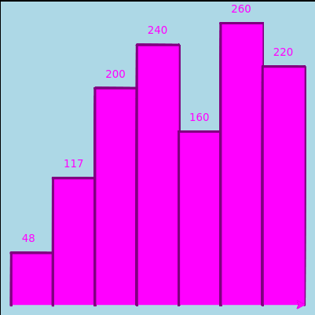