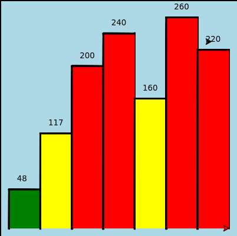
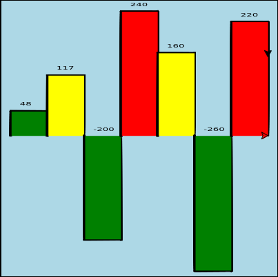
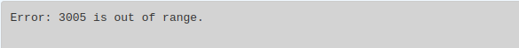

# Exercises
Problem 4
---------

> Modify the turtle bar chart program from the previous chapter so that the bar for any value of 200 or more is filled with red, values between \[100 and 200) are filled yellow, and bars representing values less than 100 are filled green.

Back at it with the turtle bar! See the last problem in chapter 6 for context. 

This one was more involved than I expected. Plus there is some unexpected behavior that I haven't quite figured out. When I tried to assign color to `alex`, it would write every number except the one to the furthest right. I have no idea why, at least not yet. My Solution was just to not include `alex` in the `getColor` function. To be honest, it looks better that why, but it's still bothering me that the last number gets left out like that.

```text-x-python
# Runestone.Academy thinkcspy course
# Chapter 7
# Problem 4	

import turtle

def getColor(tf, tw, height):
    if height >= 200:
        tf.fillcolor("red")
    elif height >= 100:
        tf.fillcolor("yellow")
    else:
        tf.fillcolor("green")

def writeData(tt, height):
    tt.up()
    tt.left(90)
    tt.forward(height+10)
    tt.right(90)
    tt.forward(10)
    tt.write(str(height))
    tt.forward(30)
    tt.right(90)
    tt.forward(height+10)
    tt.left(90)
    

def drawBar(t, height):
    """ Get turtle t to draw one bar, of height. """
    t.begin_fill()               # start filling this shape
    t.left(90)
    t.forward(height)
    t.right(90)
    t.forward(40)
    t.right(90)
    t.forward(height)
    t.left(90)
    t.end_fill()                 # stop filling this shape


xs = [48, 117, 200, 240, 160, 260, 220]  # here is the data
maxheight = max(xs)+10
numbars = len(xs)
border = 10

wn = turtle.Screen()             # Set up the window and its attributes
wn.setworldcoordinates(0-border, 0-border, 40*numbars+border, maxheight+border)
wn.bgcolor("lightblue")
wn.tracer(100)

tess = turtle.Turtle()           # create tess and set some attributes
tess.color("black")
tess.pensize(3)

alex = turtle.Turtle()

for a in xs:
    getColor(tess, alex, a)
    drawBar(tess, a)
    writeData(alex, a)
    

wn.exitonclick()
```

Result:



Problem 5
---------

> In the turtle bar chart program, what do you expect to happen if one or more of the data values in the list is negative? Go back and try it out. Change the program so that when it prints the text value for the negative bars, it puts the text above the base of the bar (on the 0 axis)

No new functions this time, but I did have to adjust the `writeData` function, the world coordinates and the data, itself, of course. 

```text-x-python
# Runestone.Academy thinkcspy course
# Chapter 7
# Problem 5	

import turtle

def getColor(tf, tw, height):
    if height >= 200:
        tf.fillcolor("red")
    elif height >= 100:
        tf.fillcolor("yellow")
    else:
        tf.fillcolor("green")

def writeData(tt, height):
    if height < 0:
        writeHeight = 0
    else:
        writeHeight = height
  
    tt.up()
    tt.left(90)
    tt.forward(writeHeight+10)
    tt.right(90)
    tt.forward(10)
    tt.write(str(height))
    tt.forward(30)
    tt.right(90)
    tt.forward(writeHeight+10)
    tt.left(90)
    

def drawBar(t, height):
    """ Get turtle t to draw one bar, of height. """
    t.begin_fill()               # start filling this shape
    t.left(90)
    t.forward(height)
    t.right(90)
    t.forward(40)
    t.right(90)
    t.forward(height)
    t.left(90)
    t.end_fill()                 # stop filling this shape


xs = [48, 117, -200, 240, 160, -260, 220]  # here is the data
maxheight = max(xs)+10
minheight = min(xs)-10
numbars = len(xs)
border = 10

wn = turtle.Screen()             # Set up the window and its attributes
wn.setworldcoordinates(0-border, 0+minheight, 40*numbars+border, maxheight+border)
wn.bgcolor("lightblue")
wn.tracer(100)

tess = turtle.Turtle()           # create tess and set some attributes
tess.color("black")
tess.pensize(3)

alex = turtle.Turtle()

for a in xs:
    getColor(tess, alex, a)
    drawBar(tess, a)
    writeData(alex, a)
    

wn.exitonclick()
```

Result:



Problem 13
----------

> Implement the calculator for the date of Easter.
> 
> The following algorithm computes the date for Easter Sunday for any year between 1900 to 2099.
> 
> Ask the user to enter a year. Compute the following:
> 
> 1.  a = year % 19
> 2.  b = year % 4
> 3.  c = year % 7
> 4.  d = (19 \* a + 24) % 30
> 5.  e = (2 \* b + 4 \* c + 6 \* d + 5) % 7
> 6.  dateofeaster = 22 + d + e
> 
> Special note: The algorithm can give a date in April. Also, if the year is one of four special years (1954, 1981, 2049, or 2076) then subtract 7 from the date.
> 
> Your program should print an error message if the user provides a date that is out of range.

We had to figure out the leap year in problem 12:

> 3 criteria must be taken into account to identify leap years:
> 
> The year is evenly divisible by 4;
> 
> If the year can be evenly divided by 100, it is NOT a leap year, unless;
> 
> The year is also evenly divisible by 400. Then it is a leap year.
> 
> Write a function that takes a year as a parameter and returns `True` if the year is a leap year, `False` otherwise.

```text-x-python
# Runestone.Academy thinkcspy course
# Chapter 7
# Problem 13

def isLeap(year):
    # your code here
    if (year % 4 == 0 and year % 100 != 0) or year % 400 == 0:
        return True
    else: 
        return False

def easter(year):
    a = year % 19
    b = year % 4
    c = year % 7
    d = (19 * a + 24) % 30
    e = (2 * b + 4 * c + 6 * d + 5) % 7
        
    if year >= 1900 and year <= 2099:
        if isLeap(year):
            dateofeaster = 22 + d + e - 7
        else:
            dateofeaster = 22 + d + e 
    else:
        dateofeaster = 0    

    return dateofeaster

def convertDate(year):
    date = easter(year)
    
    if date == 0:
        print("Error: Date is out of range.")
    elif date <= 30:
        print("In", year, "Easter falls on March", date - 1, ".")
    else:
        print("In", year, "Easter falls on April", date - 31, ".")

userYear = int(input("Enter a year between 1900 and 2099."))

convertDate(userYear)
```

Result in range:


Result out of range:

