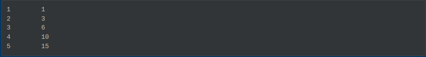
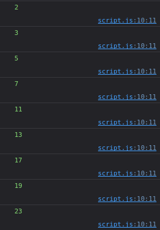
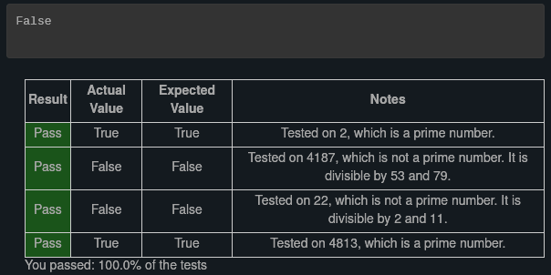
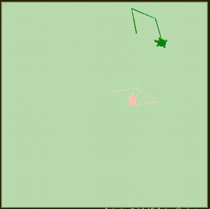
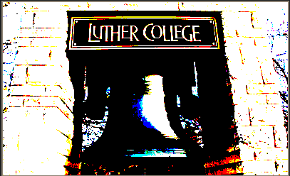
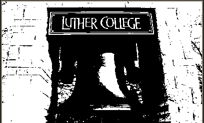

# Exercises
I won't lie, this lesson's exercises were challenging. Some of them I actually needed to look at the answers for help. Nearly all of them required some extra research. The interesting ones I was able to research and figure out on my own are included here. 

Problem 2
---------

> Write a function `print_triangular_numbers(n)` that prints out the first n triangular numbers. A call to `print_triangular_numbers(5)` would produce the following output:
> 
> ```text-plain
> 1       1
> 2       3
> 3       6
> 4       10
> 5       15
> ```
> 
> (_hint: use a web search to find out what a triangular number is._)

This one was more of a challenge than I expected. I started the problem off with just getting one triangular sum, which amounts to \\(trisum = n + (n - 1) + (n-2) + ... + (n-n)\\). Then I had to figure out how to print that sum from 1 to n. Finding the triangular sum was surprisingly easy. What wasn't easy was doing that recursively from 1 to n. 

My initial attempt was to decrement `n` the way `bound` is decremented in the final code below. The problem is, once I did that, I couldn't recover `n` for the next 4 rounds. I thought about using `i` for that purpose but remembered there was a reason I tried to use `n` first — I needed two variables: one to increment and another to decrement. 

So that's when `bound` was created. Problem was, I initialized it to the value of `n` _outside of both loops_ but then ran into the same problem I'd had with using `n` in the first place. _Finally_, I realized that I needed to recursively initialize `bound` to the value of `i` _in the first loop_ and _then_ decrement it within the second loop. 

That was a pretty fun problem! Alright, now to the solution:

```text-x-python
def print_triangular_numbers(n):
    # your code here
    i = 1

    while i <= n:
        trinum = 0
        bound = i
        
        while bound > 0:
            trinum += bound
            bound -= 1

        print(i, "\t", trinum)
        i += 1
    
print_triangular_numbers(5)
```

Result:



Problem 3
---------

> Write a function, `is_prime`, that takes a single integer argument and returns `True` when the argument is a _prime number_ and `False` otherwise.

Something good about this book I'm working in is that it shows me how many steps the code is going through to get to final outcome. In my initial working of this problem, I had `x` initialized to the absolute value of `n` - 1. And then I looked at the steps, the code was going through, figured that was too many and the remembered that after the halfway point, numbers will no longer be evenly divisible (e.g. after 10, 20 divided by any number, will produce a remainder or a fraction, depending on what you're doing with the numbers). 

With that in mind, I changed that value from `x = abs(n) - 1` to `x = abs(n) / 2`. That drastically cut down on the number of steps the program was expected to perform. I also realized that this was not necessarily a great way to test odd numbers, so initialized x to that value minus 1 and proceeded from there. 

Now the real struggle was working with primes larger than 2. Turns out that solution was simple. Return `True` if the function didn't exit during the `while` loop. 

But then we get back to the whole “taking too many steps thing”. I did more research and learned that taking the square root of `n` and making that the limit for the while loop would help the program execute a lot faster than testing if x was greater than. Then I reinitialized x to 3, incremented it by 2 instead of decrementing it by 2 and wallah! I had a program that was decently efficient and effective and it passed all the built in tests!

```text-x-python
import math

def is_prime(n):
    # your code here
    
    x = 3
  
    if abs(n) > 2:
        while x < math.sqrt(n):
            if n % 2 == 0:
                return False
            elif n % x == 0:
                return False
            else:
                x += 2
        return True
    else:
        return True

print(is_prime(4813))
```


### Correction (Oct 15, 2023):

While learning about loops and arrays in JavaScript, I had a similar problem where I had to print all the prime numbers for a given number. I came back to this one as a reference and realized that there was actually an issue with the way I looked for prime numbers. For some reason, the number 25 returned `True`, when it should have returned `False`.

 This is how I solved the problem in JavaScript:

```application-javascript-env-frontend
let n = prompt("Enter a positive integer.");

outer: 
for (let i = 2; i <= n; i++){
  
  for (let j = 2; j < i; j++){
    if (i % j == 0) continue outer;
  }

  console.log(i);    
}
```

Result with an input of 25:



With the above script as a reference, this is how I revised my solution for problem 3:

```text-x-python
# Runestone.Academy thinkcspy course
# Chapter 8
# Problem 3

def is_prime(n):
    # your code 
        
    for i in range (2, n):
        if n % i == 0:
            return False
    return True

print(is_prime(25))
```

Result:



Once again, the built in tests are not the end all be all for these problems (see chapter 9's exercises for more context). I passed the tests with the last iteration of my problem, but there was still that _one_ number (25 and maybe more), that got missed by the tests. 

Turtle Problems
---------------

I'm combining problems 4 through 6 because they build on each other.

> **Problem 4:**
> 
> Modify the walking turtle program so that rather than a 90 degree left or right turn the angle of the turn is determined randomly at each step.
> 
> **Problem 5:**
> 
> Modify the turtle walk program so that you have two turtles each with a random starting location. Keep the turtles moving until one of them leaves the screen.
> 
> **Problem 6:** 
> 
> Modify the previous turtle walk program so that the turtle turns around when it hits the wall or when one turtle collides with another turtle (when the positions of the two turtles are closer than some small number).

### Initial code from an earlier lesson section:

```text-x-python
import random
import turtle

def isInScreen(w,t):
    leftBound = - w.window_width() / 2
    rightBound = w.window_width() / 2
    topBound = w.window_height() / 2
    bottomBound = -w.window_height() / 2

    turtleX = t.xcor()
    turtleY = t.ycor()

    stillIn = True
    if turtleX > rightBound or turtleX < leftBound:
        stillIn = False
    if turtleY > topBound or turtleY < bottomBound:
        stillIn = False

    return stillIn

t = turtle.Turtle()
wn = turtle.Screen()

t.shape('turtle')
while isInScreen(wn,t):
    coin = random.randrange(0, 2)
    if coin == 0:
        t.left(90)
    else:
        t.right(90)

    t.forward(50)

wn.exitonclick()
```

### My Code

Oh boy.. this one was a lot. Problem 4 was pretty easy. All I had to do was have them go at a random angle. That initial code looked like this:

```text-x-python
import random
import turtle

def isInScreen(w,t):
    leftBound = - w.window_width() / 2
    rightBound = w.window_width() / 2
    topBound = w.window_height() / 2
    bottomBound = -w.window_height() / 2

    turtleX = t.xcor()
    turtleY = t.ycor()

    stillIn = True
    if turtleX > rightBound or turtleX < leftBound:
        stillIn = False
    if turtleY > topBound or turtleY < bottomBound:
        stillIn = False

    return stillIn

t = turtle.Turtle()
wn = turtle.Screen()

t.shape('turtle')
while isInScreen(wn,t):
    coin = random.randrange(0, 2)
    if coin == 0:
        t.left(random.randrange(1,180))
    else:
        t.right(random.randrange(1,180))

    t.forward(50)

wn.exitonclick()
```

The random starting position proved to be more challenging. The calculations were all fine from the getgo. The issue was I forgot bring the pen up before I moved the turtles to a random location. I ended up moving on to the image problems before coming back to this and realizing that lol. Here's the code for that:

```text-x-python
import random
import turtle

def isInScreen(w, t, lBound, rBound, bBound, tBound):
    turtleX = t.xcor()
    turtleY = t.ycor()

    stillIn = True
    if turtleX > rBound or turtleX < lBound:
        stillIn = False
    if turtleY > tBound or turtleY < bBound:
        stillIn = False

    return stillIn


def randGoto(t, num1, num2):
    return random.randrange(num1, num2)


def randPos(t, lBound, rBound, bBound, tBound):
    xpos = randGoto(t, lBound, rBound)
    ypos = randGoto(t, bBound, tBound)
    t.up()
    t.goto(xpos, ypos)
    t.down()

    
def randMove(wn, t1, t2, lBound, rBound, bBound, tBound):
    randPos(t1, lBound, rBound, bBound, tBound)
    randPos(t2, lBound, rBound, bBound, tBound)
    
    while isInScreen(wn, t1, lBound, rBound, bBound, tBound) and isInScreen(wn, t2, lBound, rBound, bBound, tBound):
        coin = random.randrange(0, 2)
        if coin == 0:
            t1.left(random.randrange(1,180))
            t2.left(random.randrange(1,180))
        else:
            t1.right(random.randrange(1,180))
            t2.right(random.randrange(1,180))

        t1.forward(50)
        t2.forward(50)
        

wn = turtle.Screen()
wn.bgcolor("lightblue")

x1 = -wn.window_width() / 2
x2 = wn.window_width() / 2
y1 = -wn.window_height() / 2
y2 = wn.window_height() / 2

ella = turtle.Turtle()
ella.color("pink")
ella.shape('turtle')

micah = turtle.Turtle()
micah.color("green")
micah.shape('turtle')

randMove(wn, ella, micah, x1, x2, y1, y2)


wn.exitonclick()
```

Finally, here's the code where the turtles turn around if they run into each other or into a boundary. The instructions for this one was a little vague, but I knew that if I didn't ever let the turtles escape the boundaries, I might have an infinite loop on my hands. So, the turtles, will turn around if they get close to the boundaries, but they can still pass through if they are headed in that direction between 5 and 50 points.

I also initially had the conditions for the boundaries look like this:

```text-x-python
if spaceBetween(t1x, lBound) or spaceBetween(t1x, rBound) or spaceBetween(t1y, bBound) or  spaceBetween(t1y, tBound):
	t1.right(180)
elif spaceBetween(t2x, lBound) or spaceBetween(t2x, rBound) or spaceBetween(t2y, bBound) or  spaceBetween(t2y, tBound):
    t2.right(180) 
elif spaceBetween(t1x, t2x) or spaceBetween(t1y, t2y):
    t1.left(180)
    t2.right(180) 
```

The problem with this is that only one of these will execute at a time, when really all of these conditions need to be tested “simultaneously”. So I changed all the `elif` statements to `if` statements. 

I also changed the angle from `180` to `170` and that seemed to keep the turtles from going straight through the wall when they made another turn at the coin flip part. 

Here's the final code:

```text-x-python
import random
import turtle
import math

def isInScreen(w, t, lBound, rBound, bBound, tBound):
    turtleX = t.xcor()
    turtleY = t.ycor()

    stillIn = True
    if turtleX > rBound or turtleX < lBound:
        stillIn = False
    if turtleY > tBound or turtleY < bBound:
        stillIn = False

    return stillIn


def randGoto(t, num1, num2):
    return random.randrange(num1, num2)


def randPos(t, lBound, rBound, bBound, tBound):
    xpos = randGoto(t, lBound, rBound)
    ypos = randGoto(t, bBound, tBound)
    t.up()
    t.goto(xpos, ypos)
    t.down()

    
def spaceBetween(num1, num2):
    if math.sqrt(num1**2 + num2**2) < 5:
        return True
    else: 
        return False
    
    
def randMove(wn, t1, t2, lBound, rBound, bBound, tBound):
    randPos(t1, lBound, rBound, bBound, tBound)
    randPos(t2, lBound, rBound, bBound, tBound)
    
    while isInScreen(wn, t1, lBound, rBound, bBound, tBound) and isInScreen(wn, t2, lBound, rBound, bBound, tBound):
        t1x = t1.xcor()
        t1y = t1.ycor()
        t2x = t2.xcor()
        t2y = t2.ycor()
        coin = random.randrange(0, 2)
        
        if spaceBetween(t1x, lBound) or spaceBetween(t1x, rBound) or spaceBetween(t1y, bBound) or  spaceBetween(t1y, tBound):
            t1.right(170)
        if spaceBetween(t2x, lBound) or spaceBetween(t2x, rBound) or spaceBetween(t2y, bBound) or  spaceBetween(t2y, tBound):
            t2.right(170) 
        if spaceBetween(t1x, t2x) or spaceBetween(t1y, t2y):
            t1.left(170)
            t2.right(170)
            
        if coin == 0:
            t1.left(random.randrange(1,180))
            t2.left(random.randrange(1,180))
        else:
            t1.right(random.randrange(1,180))
            t2.right(random.randrange(1,180))

        t1.forward(50)
        t2.forward(50)        
        
        

wn = turtle.Screen()
wn.bgcolor("lightblue")

x1 = -wn.window_width() / 2
x2 = wn.window_width() / 2
y1 = -wn.window_height() / 2
y2 = wn.window_height() / 2

ella = turtle.Turtle()
ella.color("pink")
ella.shape('turtle')

micah = turtle.Turtle()
micah.color("green")
micah.shape('turtle')

randMove(wn, ella, micah, x1, x2, y1, y2)


wn.exitonclick()
```

Result:

I started after the turtles already got moving, but you get the idea. 


Image problems
--------------

The following problems used the following image and code (from an earlier lesson section) as a starting point:


```text-x-python
import image

img = image.Image("luther.jpg")
win = image.ImageWin(img.getWidth(), img.getHeight())
img.draw(win)
img.setDelay(0)   # setDelay(0) turns off animation

for row in range(img.getHeight()):
    for col in range(img.getWidth()):
        p = img.getPixel(col, row)

        newred = p.getRed()
        newgreen = p.getGreen()
        newblue = p.getBlue()
        
        newpixel = image.Pixel(newred, newgreen, newblue)

        img.setPixel(col, row, newpixel)

img.draw(win)
win.exitonclick()
```

### Problem 8

> Write a function to convert the image to grayscale.

This was my initial solution. 

```text-x-python
import image

img = image.Image("luther.jpg")
win = image.ImageWin(img.getWidth(), img.getHeight())
img.draw(win)
img.setDelay(0)   # setDelay(0) turns off animation

for row in range(img.getHeight()):
    for col in range(img.getWidth()):
        p = img.getPixel(col, row)

        newred = (p.getRed()+p.getGreen()+p.getBlue())/3
        newgreen = (p.getRed()+p.getGreen()+p.getBlue())/3
        newblue = (p.getRed()+p.getGreen()+p.getBlue())/3
        
        newpixel = image.Pixel(newred, newgreen, newblue)

        img.setPixel(col, row, newpixel)

img.draw(win)
win.exitonclick()
```

And the result:


But then I had to figure out turning That into a function. I was going to go the lazy route and leave it as it was since it gave me the solution I was looking for, but then I figured actually turning this into a function would help me with the next problem. 

Here was my final solution with the function:

```text-x-python
import image

def greyScale (red, blue, green):    
    return (red + blue + green)/3

img = image.Image("luther.jpg")
win = image.ImageWin(img.getWidth(), img.getHeight())
img.draw(win)
img.setDelay(0)   # setDelay(0) turns off animation

for row in range(img.getHeight()):
    for col in range(img.getWidth()):
        p = img.getPixel(col, row)
        
        pixelColor = greyScale(p.getRed(), p.getGreen(), p.getBlue())

        newblue = newgreen = newred = pixelColor
        
        newpixel = image.Pixel(newred, newgreen, newblue)

        img.setPixel(col, row, newpixel)

img.draw(win)
win.exitonclick()
```

And the result, of course, is the same:


### Problem 9

> Write a function to convert an image to black and white.

This was my initial solution:

```text-x-python
import image

img = image.Image("luther.jpg")
win = image.ImageWin(img.getWidth(), img.getHeight())
img.draw(win)
img.setDelay(0)   # setDelay(0) turns off animation

def blackWhite (color):
    if color >= 255 / 2:
        return 255
    else:
        return 0

for row in range(img.getHeight()):
    for col in range(img.getWidth()):
        p = img.getPixel(col, row)

        newred = blackWhite(p.getRed())
        newgreen = blackWhite(p.getGreen())
        newblue = blackWhite(p.getBlue())
        
        newpixel = image.Pixel(newred, newgreen, newblue)

        img.setPixel(col, row, newpixel)

img.draw(win)
win.exitonclick()
```

The result was:



Close, but not quite. I needed black and white, not high contrast. But my intuition was in the ballpark. I figured that this would work better if I actually took the solution I got from the grey scale problem and then turned _that_ black and white. So, I went back to Problem 8, turned my solution into a function and then fixed up the code for this problem like this:

```text-x-python
import image

def greyScale (red, blue, green):
    return (red + blue + green)/3

def blackWhite (color):
    if color >= 255 / 2:
        return 255
    else:
        return 0

img = image.Image("luther.jpg")
win = image.ImageWin(img.getWidth(), img.getHeight())
img.draw(win)
img.setDelay(0)   # setDelay(0) turns off animation

for row in range(img.getHeight()):
    for col in range(img.getWidth()):
        p = img.getPixel(col, row)
        
        pixelColor = greyScale(p.getRed(), p.getGreen(), p.getBlue())
        
        newblue = newgreen = newred = blackWhite(pixelColor)
        
        newpixel = image.Pixel(newred, newgreen, newblue)

        img.setPixel(col, row, newpixel)

img.draw(win)
win.exitonclick()
```



### Problem 10

> Sepia Tone images are those brownish colored images that may remind you of times past. The formula for creating a sepia tone is as follows:
> 
> ```text-plain
> newR = (R × 0.393 + G × 0.769 + B × 0.189)
> newG = (R × 0.349 + G × 0.686 + B × 0.168)
> newB = (R × 0.272 + G × 0.534 + B × 0.131)
> ```
> 
> Write a function to convert an image to sepia tone. _Hint:_ Remember that rgb values must be integers between 0 and 255.

This didn't take too much effort since they gave me the formula. Just sharing, because I think it's cool.

```text-x-python
import image


img = image.Image("luther.jpg")
win = image.ImageWin(img.getWidth(), img.getHeight())
img.draw(win)
img.setDelay(0)   # setDelay(0) turns off animation
        

for row in range(img.getHeight()):
    for col in range(img.getWidth()):
        p = img.getPixel(col, row)
        
        R = p.getRed()
        G = p.getGreen()
        B = p.getBlue()
        
        newred = (R * 0.393 + G * 0.769 + B * 0.189)
        newgreen = (R * 0.349 + G * 0.686 + B * 0.168)
        newblue = (R * 0.272 + G * 0.534 + B * 0.131)
        
        newpixel = image.Pixel(newred, newgreen, newblue)

        img.setPixel(col, row, newpixel)

img.draw(win)
win.exitonclick()
```

Result:

