# Exercises
This one was fun! I had no idea that manipulating strings could be as interesting as manipulating numbers or pixels. These exercises were certainly some of the more challenging ones thus far, but I got through them all!

Problem 3
---------

> Assign to a variable in your program a triple-quoted string that contains your favorite paragraph of text - perhaps a poem, a speech, instructions to bake a cake, some inspirational verses, etc.
> 
> Write a function that counts the number of alphabetic characters (a through z, or A through Z) in your text and then keeps track of how many are the letter ‘e’. Your function should print an analysis of the text like this:
> 
> ```text-plain
> Your text contains 243 alphabetic characters, of which 109 (44.8%) are 'e'.
> ```

My Solution:

```text-x-python
# Runestone.Academy thinkcspy course
# Chapter 9
# Problem 3

import string

def count(p):
    # your code here
    abc = 0
    e = 0
    alphabet = string.ascii_lowercase + string.ascii_uppercase
    
    for achar in p:
        for alphaChar in alphabet:
            if achar == alphaChar:
                abc += 1
        if achar == "e" or achar == "E":
            e += 1
            
    if abc != 0:        
        ePerAbc = e / abc * 100
    else:
        ePerAbc = 0
    
    finalMsg = "Your text contains {} alphabetic characters, of which {} ({:.1f}%) are 'e'.".format(abc, e, ePerAbc)
            
    return finalMsg
    
text = "Bell of the ball"
print(count(text))
```

Result:

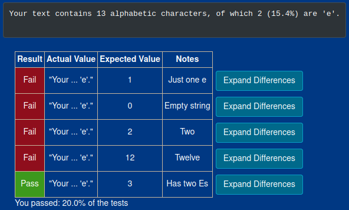

I failed a lot of the built in tests for this one, but the output is is fine. I think they were looking for individual variables to be returned somewhere, maybe in separate functions. 

I looked at the answer for this one to see if I was missing anything, and the answer provided also failed the built in tests due to a division be zero error so uh… I'm going to table this one and call it a win. 

Here is their code and the results:

```text-x-python
# Runestone.Academy thinkcspy course
# Chapter 9
# Answer 3

def count(p):
    lows = "abcdefghijklmnopqrstuvwxyz"
    ups =  "ABCDEFGHIJKLMNOPQRSTUVWXYZ"

    numberOfe = 0
    totalChars = 0
    for achar in p:
        if achar in lows or achar in ups:
            totalChars = totalChars + 1
            if achar == 'e':
                numberOfe = numberOfe + 1

    percent_with_e = (numberOfe / totalChars) * 100
    print("Your text contains", totalChars, "alphabetic characters of which", numberOfe, "(", percent_with_e, "%)", "are 'e'.")


p = '''
"If the automobile had followed the same development cycle as the computer, a
Rolls-Royce would today cost $100, get a million miles per gallon, and explode
once a year, killing everyone inside."
-Robert Cringely
'''

count(p)
```

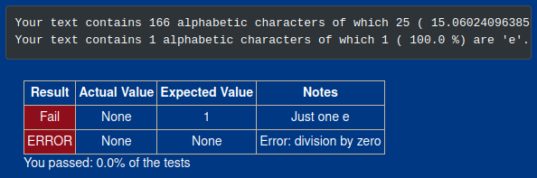

Problem 4
---------

> Print out a neatly formatted multiplication table, up to 12 x 12.

My code:

```text-x-python
# Runestone.Academy thinkcspy course
# Chapter 9
# Problem 4

# your code here

num1 = 1
product = 0

for n in range(12):
    num2 = 1
    row = ""

    for x in range(12):
        product = num1 * num2
        row += "{} \t".format(product)
        num2 += 1

    print(row)
    num1 += 1
```

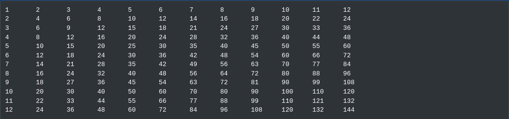

Problem 5
---------

> Write a function that will return the number of digits in an integer.

My code:

```text-x-python
# Runestone.Academy thinkcspy course
# Chapter 9
# Problem 

def numDigits(n):
    # your code here
    toText = str(n)
    count = 0
    
    for i in range (len(toText)):
        count += 1
        
    return count
    
print(numDigits(13))
```

Result:

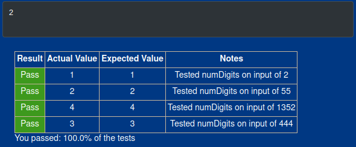

The Letter Problems
-------------------

The following three problems are very interrelated. I would work on one and realize the previous one needed to be changed too. Strap in, because this next section is hella long. 

### Problem 10

> Write a function that counts how many non-overlapping occurences of a substring appear in a string.

For such a short piece of code, this one really threw me for a loop. First, I had to get help figuring out exactly what “non-overlapping occurrences” meant in the context of a string, lol (_"anan"_ has overlapping occurrences of _“an”_, _“panpan”_ does not). Then, I had to figure out moving through the text by substring while also comparing more than just the first occurrence of that substring. Finally, I had to make sure the program understood _when to count_, which was tightly connected with how the program moved through the string. 

Hopefully my code can explain this better than I can in English:

```text-x-python
# Runestone.Academy thinkcspy course
# Chapter 9
# Problem 10

def count(substr,theStr):
    # your code here
    count = 0
    char = 0
    pos1 = 0
    pos2 = len(substr)
    charPos = len(substr) + 1
    
    while char < len(theStr):
        if substr == theStr[pos1:pos2]:
            count += 1
            char += charPos
        else:
            char += 1
            
        pos1 += 1
        pos2 += 1
        
    return count

print(count("e", "tree"))
```

Result:

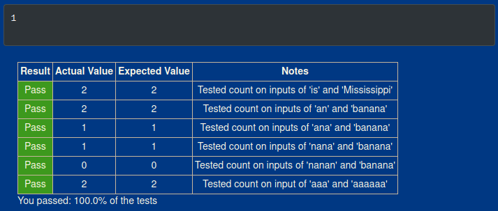

~I'm really glad this one had unit tests on it, because it helped me validate if I understood the instructions and if I gave the program the right instructions. This problem alone is a great practice for “thinking like a computer scientist” as it were.~ 

That test didn't mean shit. When I went to the next problem, I realized there was a problem with the program, even though my initial tests and the built in checks checked out. 

The problem was that my solution broke down when the program looked for only 1 character. When I put a non repeating character in between repeating characters like in _"banana"_, and looked for _"a"_, the program only counted _two “a's” instead of three, even though the “a's” were not “overlapping occurrences”._ 

I eventually realized that I needed to move through the string differently for single characters in a non-overlapping context, so I added this conditional block to the existing one (I changed `char` to `charCount` because the latter makes more sense for the use of the variable):

```text-x-python
elif len(substr) == 1 and substr == theStr[pos1:pos2]:
	count += 1
    charCount += 1
```

But now I had a different problem. The original version of the code was working perfectly fine for words like “tree”. This additional code, now meant that overlapping characters in these types of words, were being counted. That meant that I either needed to modify an existing condition or add another conditional block. 

I opted to modify an existing condition, the original `if` block, and test if the next letter was the same as the current. Great test, but by this point I began playing a game of whack-a-mole. The thing that fixed tests for words like “tree” broke tests words like “banana”, especially when the last letter of the word just so happened to be the letter the program was looking for. 

Eventually I switched the order of the if and elif blocks, because that simplified the program and kept the conditions from becoming monstrously long and difficult to understand. Then, I finally had the good sense to check if `pos2` was numerically equivalent to the length of the string. This way the program wouldn't keep looking for an index position that was out of range (because computers count from 0… not 1).

And with that, I finally found something that, to the best of my current knowledge, could handle any length of strings and substrings given to it. Here's the final code:

```text-x-python
# Runestone.Academy thinkcspy course
# Chapter 9
# Problem 10

def count(substr,theStr):
    # your code here
    count = 0
    charCount = 0
    pos1 = 0
    pos2 = len(substr)
    charPos = len(substr)
    
    while charCount < len(theStr):
        if charPos == 1 and substr == theStr[pos1] and (pos2 == len(theStr) or substr != theStr[pos2]):
            count += 1
            charCount += 1
        elif  substr == theStr[pos1:pos2]:
            count += 1
            charCount += charPos + 1
        else:
            charCount += 1
            

        pos1 += 1
        pos2 += 1
                
    return count

print(count("e", "treeleee"))
```

I used `treeleee` as a test, because it allowed me to test for all the conditions that I had failed before finding this solution. By those metrics, this bit of code took me to the finish line. Below are the results:

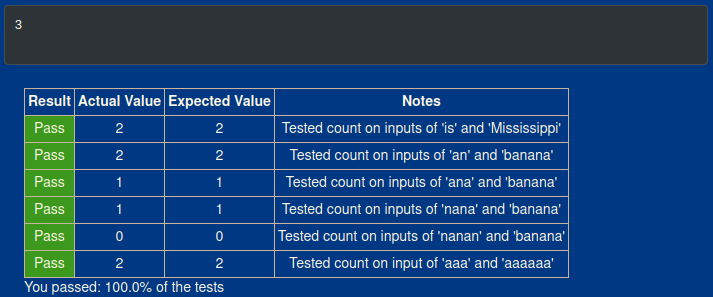

Also, this is the 2nd built in test to fall short in these exercises. I'll probably be a little less excited when I pass them and less concerned when I don't.

### Problem 11

> Write a function that removes the first occurrence of a string from another string.

So I started with this and then realized there was an issue with the program and went back to problem 10 to fix it. 

```text-x-python
# Runestone.Academy thinkcspy course
# Chapter 9
# Problem 11

def remove(substr,theStr):
    # your code here
    char = 0
    pos1 = 0
    pos2 = len(substr)
    found = False
    newStr = ""
    
    while char < len(theStr) and not found:
        currentPos = theStr[pos1:pos2]
        if substr == currentPos:
            found = True
        else:
            char += 1
            newStr = theStr[:pos2]
            
        pos1 += 1
        pos2 += 1
    
    newStr += theStr[pos2:]
    
    return newStr

print(remove("e", "tree"))
```

Then I came back with this:

```text-x-python
# Runestone.Academy thinkcspy course
# Chapter 9
# Problem 11

def remove(substr,theStr):
    # your code here
    count = 0
    charCount = 0
    pos1 = 0
    pos2 = len(substr)
    charPos = len(substr)
    found = False
    newStr = ""
    
    while charCount < len(theStr) and not found:
        if charPos == 1 and substr == theStr[pos1] and (pos2 == len(theStr) or substr != theStr[pos2]):
            count += 1
            charCount += 1
            found = True
        elif  substr == theStr[pos1:pos2]:
            count += 1
            charCount += charPos + 1
            found = True
        else:
            charCount += 1
            newStr = theStr[:pos2]
            
        pos1 += 1
        pos2 += 1
                
    newStr += theStr[pos2:]
    
    return newStr

print(remove("e", "tree"))
```

Well… this code basically does the same thing as the previous bit of code, so I went back to the previous one, because why have more complicated code to do essentially the same thing?

The problem (or at least one of the problems) in my code was here:

```text-x-python
else:
	char += 1
	newStr = theStr[:pos2]
```

Specifically, the way I coded `newStr`. If there is no match. it takes everything up to `pos2` which, by nature of how I wrote the code, includes code that I actually wanted to take out!

I realized that I didn't actually need to change `newStr` in the `else` block. I actually needed to change it in the `if` block, and I needed to create another conditional block to finish constructing the word based on whether or not the substring was found:

```text-x-python
if found:
	newStr += theStr[pos2-1:]
else:
    newStr = theStr
```

And wallah, it worked! Here is the ~final~ code (I changed a variable name for the same reason I changed it in the previous problem):

```text-x-python
# Runestone.Academy thinkcspy course
# Chapter 9
# Problem 11

def remove(substr,theStr):
    # your code here
    charCount = 0
    pos1 = 0
    pos2 = len(substr)
    found = False
    newStr = ""
    
    while charCount < len(theStr) and not found:
        currentPos = theStr[pos1:pos2]
        if substr == currentPos:
            newStr = theStr[:pos1]
            found = True
        else:
            charCount += 1
            
        pos1 += 1
        pos2 += 1
    
    if found:
        newStr += theStr[pos2-1:]
    else:
        newStr = theStr
    
    return newStr

print(remove("e", "tree"))
print(remove("iss", "Mississippi"))
print(remove("an", "banana"))
print(remove("e", "treeeleee"))
```

Results:

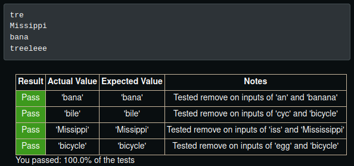

But now… I had a new challenge… 

### Problem 12

> Write a function that removes all occurrences of a string from another string.

My initial logic was to break the initial `while` statement of the previous solution into nesting `while` statements and initialize in the variables in the first one:

```text-x-python
# Runestone.Academy thinkcspy course
# Chapter 9
# Problem 12

def remove_all(substr,theStr):
    # your code here
    charCount = 0

    while charCount < len(theStr):
        pos1 = 0
        pos2 = len(substr)
        found = False
        newStr = ""

        while not found:
            currentPos = theStr[pos1:pos2]
            if substr == currentPos:
                newStr = theStr[:pos1]
                found = True
            else:
                charCount += 1

            pos1 += 1
            pos2 += 1
    
    if found:
        newStr += theStr[pos2-1:]
    else:
        newStr = theStr
    
    return newStr

print(remove_all("e", "tree"))
print(remove_all("iss", "Mississippi"))
print(remove_all("an", "banana"))
print(remove_all("e", "treeeleee"))
```

I may as well had not made any changes at all, because it just gave the same results as if the code were the exact same. 

Then, I realized that, unlike in the first problem, I actually needed to adjust `newStr` in an `else` statement, or more specifically in an `elif` statement to test if the condition had been found:

```text-x-python
elif not found:
	charCount += 1
    newStr = theStr[:pos1+1]
```

This block ensured that I still had any characters that existed before any matches were found. But I still had the issue of adding characters after any matches were found. I had bunch of failed ideas, but finally I came up with one that produced better results:

```text-x-python
# Runestone.Academy thinkcspy course
# Chapter 9
# Problem 12

def remove_all(substr,theStr):
    # your code here
    charCount = 0
    pos1 = 0
    pos2 = len(substr)
    newStr = theStr
    
    while charCount < len(newStr):
        currentPos = newStr[pos1:pos2]
        
        if substr == currentPos:
            newStr = newStr[:pos1+1] + newStr[pos2+1:]
            charCount += 1
        else:
            pos1 += 1
            pos2 += 1
            charCount += 1
       
    return newStr

print(remove_all("e", "tree"))
print(remove_all("iss", "Mississippi"))
print(remove_all("an", "banana"))
print(remove_all("e", "treeeleee"))
```

I took out everything related to the `found` variable, because I no longer needed to stop the program once the first instance of `substr` was found. I then moved the iteration of `pos1` and `pos2` to the `else` block, because if nothing was found, then we needed to move on to the next set of characters, but _only if nothing was found._ 

~T~his allowed me to pass most of the built in checks and half my own~, but there was still a piece missing~. Actually, there were too many pieces. 

It turns out that I didn't need to add to `pos1` and `pos2` when recreating `newStr`, because the end of an index is excluded and the beginning is excluded. Additionally, the variable I needed to test for in the while loop was actually `pos1`. `charCount` was redundant. Turns out, it was redundant in the previous problem's code too. 

Here's the final code:

```text-x-python
# Runestone.Academy thinkcspy course
# Chapter 9
# Problem 12

def remove_all(substr,theStr):
    # your code here
    pos1 = 0
    pos2 = len(substr)
    newStr = theStr
    
    while pos1 < len(newStr):
        currentPos = newStr[pos1:pos2]
        
        if substr == currentPos:
            newStr = newStr[:pos1] + newStr[pos2:]
        else:
            pos1 += 1
            pos2 += 1
       
    return newStr


print(remove_all("e", "treeeleee"))
```

Results:

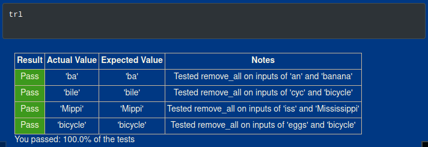

And the _actual_ final code for problem 11:

```text-x-python
# Runestone.Academy thinkcspy course
# Chapter 9
# Problem 11

def remove(substr,theStr):
    # your code here
    pos1 = 0
    pos2 = len(substr)
    found = False
    newStr = theStr
    
    while pos1 < len(newStr) and not found:
        currentPos = newStr[pos1:pos2]
        
        if substr == currentPos:
            newStr = newStr[:pos1] + newStr[pos2:]
            found = True
        else:
            pos1 += 1
            pos2 += 1
    
    return newStr

print(remove("e", "tree"))
print(remove("iss", "Mississippi"))
print(remove("an", "banana"))
print(remove("e", "treeeleee"))
```

Results:

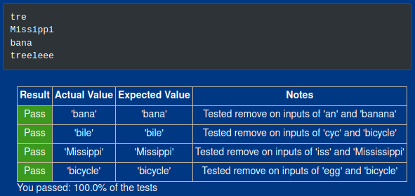

Problem 14
----------

> Here is a dragon curve. Use 90 degrees.:
> 
> ```text-plain
> FX
> X -> X+YF+
> Y -> -FX-Y
> ```

Most of this code came from the lesson on L-Systems in this chapter. I'm just including it here, because I think it's cool and wanted to show at least one of these types of problems in this set of exercises. 

The code:

```text-x-python
# Runestone.Academy thinkcspy course
# Chapter 9
# Problem 14

# Your code here
import turtle

def createLSystem(numIters,axiom):
    startString = axiom
    endString = ""
    for i in range(numIters):
        endString = processString(startString)
        startString = endString

    return endString

def processString(oldStr):
    newstr = ""
    for ch in oldStr:
        newstr = newstr + applyRules(ch)

    return newstr

def applyRules(ch):
    newstr = ""
    if ch == 'X':
        newstr = 'X+YF+'   # Rule 1
    elif ch == 'Y':
        newstr = '-FX-Y'   # Rule 2
    else:
        newstr = ch    # no rules apply so keep the character

    return newstr

def drawLsystem(aTurtle, instructions, angle, distance):
    for cmd in instructions:
        if cmd == 'F':
            aTurtle.forward(distance)
        elif cmd == 'B':
            aTurtle.backward(distance)
        elif cmd == '+':
            aTurtle.right(angle)
        elif cmd == '-':
            aTurtle.left(angle)

def main():
    inst = createLSystem(10, "FX")   # create the string
    print(inst)
    t = turtle.Turtle()            # create the turtle
    wn = turtle.Screen()
    wn.tracer(10)

    t.up()
    t.back(100)
    t.down()
    t.speed(0)
    drawLsystem(t, inst, 90, 5)   # draw the picture
                                  # angle 90, segment length 5
    wn.exitonclick()

main()
```

Results:

I'm just including the visual result, because the text is just a _very loooonng_ string of repeating `FX+YF++-FX-YF++-FX+YF+--`.

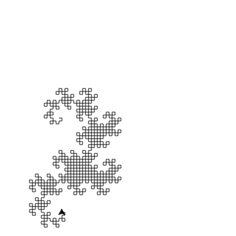

Encrypt, Decrypt
----------------

I needed a little help figuring out transferring one index to the other, but once I got that, it was smooth sailing from there. 

### Problem 18

> Write a function that implements a substitution cipher. In a substitution cipher one letter is substituted for another to garble the message. For example A -> Q, B -> T, C -> G etc. your function should take two parameters, the message you want to encrypt, and a string that represents the mapping of the 26 letters in the alphabet. Your function should return a string that is the encrypted version of the message.

My code:

```text-x-python
# Runestone.Academy thinkcspy course
# Chapter 9
# Problem 18

import string

def encrypt(msg, code):
    alpha = string.ascii_lowercase
    newStr = ""
    pos = 0
    msg = msg.lower()
    
    for char in msg:
        if char in alpha:
            pos = alpha.index(char)
            newStr += newAlpha[pos]
        else:
            newStr += char    # no rules apply so keep the character

    return newStr

newAlpha = "qwertyuiopasdfghjklzxcvbnm"

print(encrypt("Hello World!", newAlpha))
```

Result:

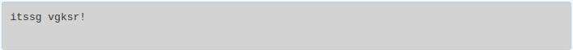

### Problem 19

> Write a function that decrypts the message from the previous exercise. It should also take two parameters. The encrypted message, and the mixed up alphabet. The function should return a string that is the same as the original unencrypted message.

I literally just had to switch the role of the two indexes:

```text-x-python
# Runestone.Academy thinkcspy course
# Chapter 9
# Problem 19

import string

def decrypt(msg, code):
    alpha = string.ascii_lowercase
    newStr = ""
    pos = 0
    msg = msg.lower()
    
    for char in msg:
        if char in alpha:
            pos = newAlpha.index(char)
            newStr += alpha[pos]
        else:
            newStr += char    # no rules apply so keep the character

    return newStr

newAlpha = "qwertyuiopasdfghjklzxcvbnm"

print(decrypt("itssg vgksr!", newAlpha))
```

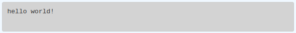

### Problem 21

> Write a function called `rot13` that uses the Caesar cipher to encrypt a message. The Caesar cipher works like a substitution cipher but each character is replaced by the character 13 characters to ‘its right’ in the alphabet. So for example the letter a becomes the letter n. If a letter is past the middle of the alphabet then the counting wraps around to the letter a again, so n becomes a, o becomes b and so on. _Hint:_ Whenever you talk about things wrapping around its a good idea to think of modulo arithmetic.

That hint at the end was really helpful. The one thing I messed up on was forgetting that lists in programming languages tend to start at 0 instead of 1. I had to print `pos` before I figured out what the issue was, but once I did, it was an easy fix. Here's the final code:

```text-x-python
# Runestone.Academy thinkcspy course
# Chapter 9
# Problem 21

import string

def rot13(mess):
    # Your code here
    alpha = string.ascii_lowercase
    newStr = ""
    pos = 0
    mess = mess.lower()
    
    for char in mess:
        if char in alpha:
            pos = alpha.index(char)
            
            if pos <= 12:
                pos += 13
            else:
                pos = pos % 13
           
            newStr += alpha[pos]
            
        else:
            newStr += char    # no rules apply so keep the character
        
    return newStr

print(rot13('abcde'))
print(rot13('nopqr'))
print(rot13(rot13('Since rot13 is symmetric you should see this message')))
```

Results:

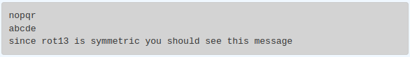